--- 
title: "pRolocGUI - Interactive visualisation of spatial proteomics data" 
author: "Lisa Breckels, Thomas Naake and Laurent Gatto" 
output:  
  BiocStyle::html_document
vignette: >
  %\VignetteIndexEntry{pRolocGUI - Interactive visualisation of spatial proteomics data} 
  %\VignetteEngine{knitr::rmarkdown}
  %\VignetteEncoding{UTF-8}
  %\VignettePackage{pRolocGUI}
---


# Foreword

`r Biocpkg("pRolocGUI")` is under active development; current 
functionality is evolving and new features will be added. This 
software is free and open-source. You are invited to open issues 
in the [Github `pRolocGUI` repository](https://github.com/ComputationalProteomicsUnit/pRolocGUI/issues) 
in case you have any questions, suggestions or have found any bugs or typos. 
To reach a broader audience for more general questions about 
proteomics analyses using R consider of writing to the 
[Bioconductor Support Forum](https://support.bioconductor.org).


# Introduction

This vignette describes the implemented functionality of the
`pRolocGUI` package. The package is based on the `MSnSet` class
definitions of `r Biocpkg("MSnbase")` and on the functions defined in
the `r Biocpkg("pRoloc")` package. `r Biocpkg("pRolocGUI")` is
intended for, but not limited to, the interactive visualisation and
analysis of quantitative spatial proteomics data. To achieve
reactivity and interactivity, `pRolocGUI` relies on the
[`shiny`](http://www.rstudio.com/shiny/) framework. We recommend some
familiarity with the `MSnSet` class (see `?MSnSet` for details) and
the `pRoloc` vignette (see `vignette("pRoloc-tutorial")`) before using
`pRolocGUI`.

There are 3 applications distributed with `pRolocGUI` which are
wrapped and launched by the `pRolocVis` function. These 3 applications
are called according to the argument `app` in the `pRolocVis`
function which may be one of "main", "classify" or
"compare". 

* The `main` application launches a Principal Components Analysis (PCA) 
plot of the data, with an alternate profiles tab for visualisation of 
protein profiles, it also features a searchable data table for the
identification of proteins of interest.
* The `classify` application has been designed to view machine 
learning classification results according to user-specified thresholds
for the assignment of sub-cellular location.
* The `compare` application allows the comparison of two comparable 
`MSnSet` instances, e.g. this might be of help for the analyses of
changes in protein localisation in different conditions. 


## Getting started

Once R is started, the first step to enable functionality of the
package is to load it, as shown in the code chunk below.  We also load
the `r Biocpkg("pRolocdata")` data package, which contains
quantitative proteomics datasets.

```{r loadPkgs, message = FALSE, warning = FALSE} 
library("pRolocGUI")
library("pRolocdata")
```

We begin by loading the dataset `hyperLOPIT2015` from the `pRolocdata`
data package. The data was produced from using the hyperLOPIT
technology on mouse E14TG2a embryonic stem cells ([Christoforou et al 2016](http://www.nature.com/ncomms/2016/160112/ncomms9992/full/ncomms9992.html)). 
For more background spatial proteomics data anlayses please see 
[Gatto et al 2010](http://www.ncbi.nlm.nih.gov/pubmed/21080489), 
[Gatto et al 2014](http://www.ncbi.nlm.nih.gov/pubmed/24846987) and also the 
[`pRoloc` tutorial vignette](http://bioconductor.org/packages/release/bioc/vignettes/pRoloc/inst/doc/pRoloc-tutorial.pdf). 

```{r loadData, echo = TRUE, message = FALSE, warning = FALSE}
data(hyperLOPIT2015) 
```

To load one of the applications using the `pRolocVis` function and
view the data you are required to specify a minimum of one key
argument, `object`, which is the data to display and must be of 
class `MSnSet` (or a `MSnSetList` of
length 2 for the `compare` application). Please see
`vignette("pRoloc-tutorial")` or `vignette("MSnbase-io")` for
importing and loading data. The argument `app` tells the `pRolocVis`
function what type of application to load. One can choose
from: `"main"` (default), `"classify"`, `"compare"`.  The optional 
argument `fcol` (and `fcol1` and `fcol2` for the compare app)
can be used which allows the user to specify the 
feature meta-data label(s) (`fData` column name(s)) to be plotted. 
The default is `markers` (i.e. the labelled data) for the PCA and compare 
For the classification app one must specify the prediction column i.e. the
feature meta-data label that corresponds to the column containing the
classification results, generated from running a supervised machine
learning analysis (see [below](#the-classify-application)).

For example, to load the main `pRolocVis` application:

```{r example, eval = FALSE, echo = TRUE} 
pRolocVis(object = hyperLOPIT2015, fcol = "markers") 
```

Launching any of the `pRolocVis` applications will open a new tab in a
separate pop-up window, and then the application can be opened in your
default Internet browser if desired, by clicking the 'open in browser'
button in the top panel of the window.

To stop the applications from running press `Esc` or `Ctrl-C` in the
console (or use the "STOP" button when using RStudio) and close the
browser tab, where `pRolocVis` is running.

## Which app should I use?  

There are 3 different applications, each one designed to address a 
different specific user requirement.

* The main app is intended for exploratory data analysis, 
which features a clickable interface and zoomable PCA plot. If you would
like to search for a particular protein or set of proteins this is the
application to use. This app also features a protein profiles tab, 
designed for examining the patterns of user-specified
sets of proteins. For example, if one has several overlapping
sub-cellular clusters in their data, as highlighted by the PCA plot or
otherwise, one can check for separation in all data dimensions by
examining the protein profile patterns. Proteins that co-localise are
known to exhibit similar distributions (De Duve's principale).
* The classification app can be used for viewing the sub-cellular class 
predictions output from a supervised machine learning analysis and to
help the user set a classification threshold (see the [`pRoloc`
tutorial](http://bioconductor.org/packages/release/bioc/vignettes/pRoloc/inst/doc/pRoloc-tutorial.pdf)
for details on spatial proteomics data analysis).
* The comparison application may be of interest if a user wishes to 
examine two replicate experiments, or two experiments from different
conditions etc.  Two PCA plots are loaded side-by-side and one can
search and identify common proteins between the two data sets. As per the 
main application there is also a protein profiles tab to allow one to look
at the patterns of protein profiles of interest in each dataset. 

# The `main` application

The `main`, default, application is characterised by an interactive and
searchable Principal Components Analysis (PCA) plot. PCA is an
ordinance method that can be used to transform a high-dimensional
dataset into a smaller lower-dimenensional set of uncorrelated
variables (principal components), such that the first principal
component has the largest possible variance to account for as much
variability in the data as possible. Each succeeding component in turn
has the highest variance possible under the constraint that it be
orthogonal to the preceding components. Thus, PCA is particularly
useful for visualisation of multidimensional data in 2-dimensions,
wherein all the proteins can be plotted on the same figure.

The application is subdivided in to three tabs: (1) PCA, (2) Profiles, 
and (3) Table Selection.  A searchable data table containing the experimental 
feature meta-data is permanantly dispalyed at the bottom of the screen for
ease. You can browse between the tabs by simply clicking on them at the top
of the screen.

To run the `main` application using `pRolocVis`: 

```{r pca1, eval = FALSE, echo = TRUE} 
pRolocVis(object = hyperLOPIT2015, fcol = "markers") 
```

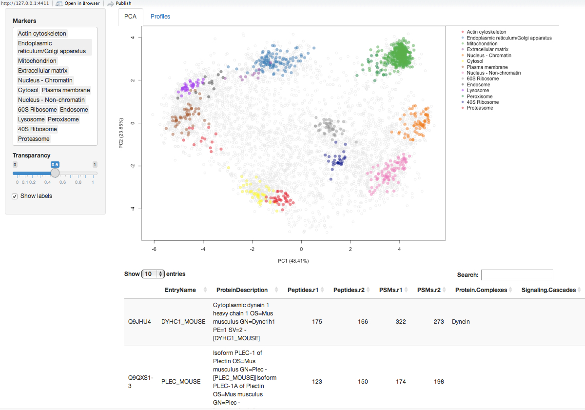

**Viewing** The PCA tab is characterised by its main panel which shows
a PCA plot for the selected `MSnSet`. By default a PCA plot is used to
display the data and the first two principal components are plotted.
The sidebar panel controls what features to highlight on the PCA plot.
Under the 'Labels' menu, input can be selected by clicking on and off
the data class names, or by typing and  searching in the white input
box. Selected items can then be deleted, by clicking on the name of the
class and pressing the delete button on your keyboard. The PCA plot will
then be updated accordingly. Below the select box is a 'transparancy' slider 
bar which controls the opacity of the highlighted data classes and two action
buttons 'Zoom/reset plot' and 'Clear selection', which are described below. 

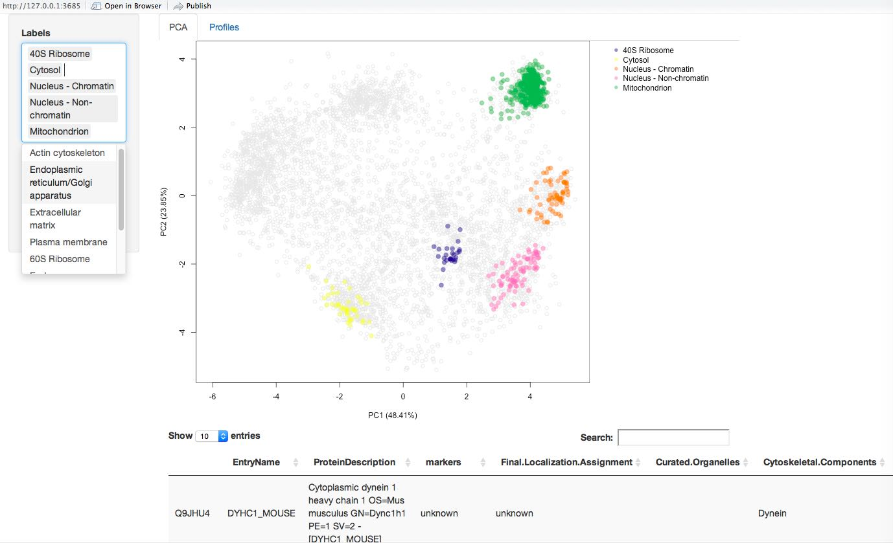

**Searching** Below the PCA plot is a searchable data table containing
the fetaure meta data (`fData`). For LOPIT experiments, such as the
one used in this example, this may contain protein accession numbers,
protein entry names, protein description, the number of quantified
peptides per protein, and columns containing sub-cellular localisation
information. The data table is limited to displaying 12 columns of
information, these are automatically selected from the `fData` to be
the first 6 and last features. To select specific columns in the 
`fData` to display in the data table use the `fdataInds` argument, see
`?pRolocVis` for more details.One can search for proteins of interest by 
using the white search box, above the table to the right. Searching is 
done by partial pattern matching with table elements. Any matches or 
partial text matches that are found are highlighted in the data
table. To select/unselect a protein of interest one can simply
click/unclick on the corresponding entry in the table or double click
directly on a protein of interest on the interactive PCA plot. If a protein(s)
in the table is clicked and selected the row in the table will turn
grey and the protein(s) will be highlighted on the PCA plot by a dark
grey circle(s), if the 'Show labels' box is checked in the left sidebar
panel the protein names for the selected protein(s) will also be shown
on the PCA plot. Any selected proteins on the PCA plot or in the table
can be cleared at any time by clicking the 'Clear selection' button on
the left hand side panel.

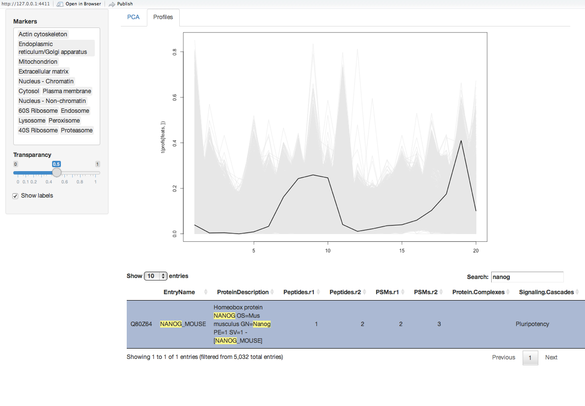

**Zooming** If a user wishes to examine a protein(s) in more detail,
one can zoom in on specific points by hovering the mouse over the plot, 
then clicking and drawing a (square) brush and then clicking the 
'Zoom/reset button' in the left side panel to zoom to the brushed area. 
This process can be repeated until the desired level of zoom is reached. 
The plot can be resetted to the original size by clicking the 
'Zoom/reset button' once again.

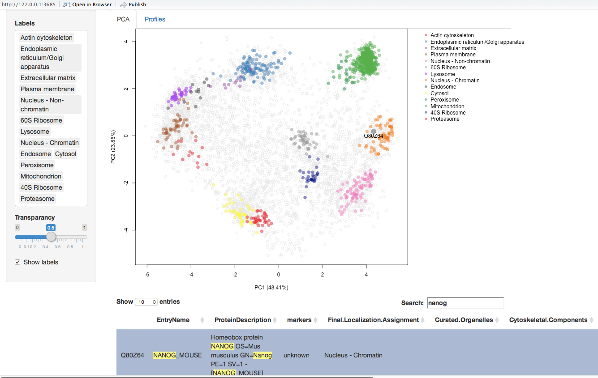
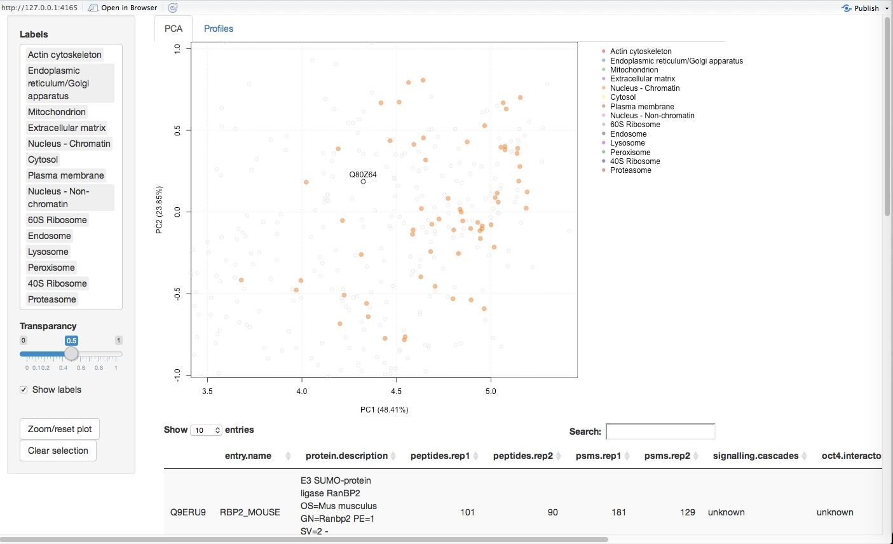

**Profiles** By clicking the profiles tab at the top of the 
page a protein profiles plot is displayed that shows
the quantitation data that is stored in the `exprs` data slot 
of the `MSnSet`. For the `hyperLOPIT2015` dataset this is the relative 
abundances of each protein across the 20 fractions (2 x 10-plex replicates). 
As per the PCA tab, the profiles plot can also be updated according 
to the input selected in the sidebar panel on the left.

The profiles tab may be useful to
specifically look for discrimination between (potentially
overlappling) sub-cellular niches. It allows one to do
this in an easy and direct manor where all proteins belonging to the
same sub-cellular niche/data cluster (as specified by `fcol`) are
loaded together. The protein distribution patterns can then be
examined on a group vs group basis. Proteins of interest can be
searched in the data table and once clicked, the distribution(s) 
of selected protein(s) are shown by black lines. 

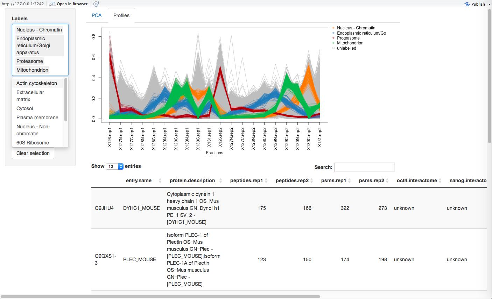
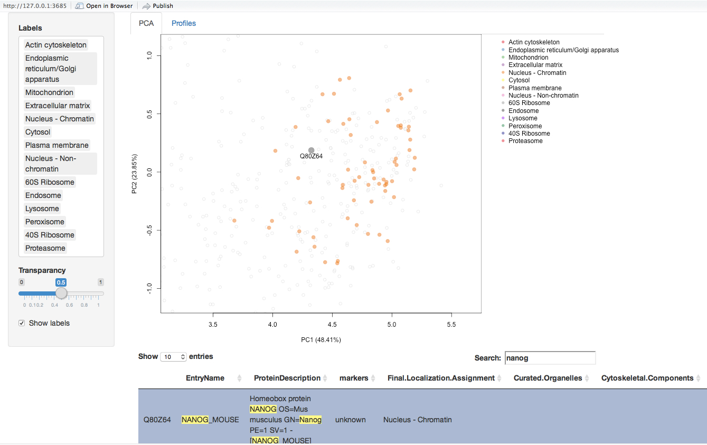

**Features** There is also functionality to use the
`FeaturesOfInterest`/`FoICollection` infrastructure distributed by the
`MSnbase` package (for examples on how to create `FeaturesOfInterest`
see the [`pRoloc`
tutorial](http://bioconductor.org/packages/release/bioc/vignettes/pRoloc/inst/doc/pRoloc-tutorial.pdf))`.

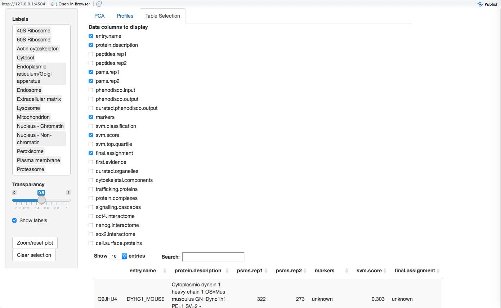

**Table Selection** The Table Selection tab provides an interface 
for data table column selection. Multiple columns can be selected on and 
off by clicking/unclicking the checkboxes that correspond to the columns
in the data table.

**Note:** Other ordinance methods are available for displaying
the data, for example, multidimensional scaling (MDS), and kernal-PCA,
and t-SNE are all supported, and can be specified using the `method`
argument when caling `pRolocVis` (this is not supported in the `compare` or
`classify` application).

# The `classify` application

Machine learning classification forms a large part of spatial
proteomics data analysis. Protein localisation prediction can be cast
as a supervised machine learning problem (learning from labelled instances), wherein one has a set of a
few well-known examples (labelled data), that is sub-cellular protein
markers (proteins that are known to belong to a set of finite sub-cellular
niches), which can used to learn a classifier to associate unlabelled
proteins to one of the sub-cellular classes that appear in the
labelled training data.

In the example below, we use one of the classification algorithms from the `r Biocpkg("pRoloc")`
package; a Support Vector Machine (SVM) classifier, and train a model for
protein localisation prediction of unassigned proteins in the
`hyperLOPIT2015` dataset. We first use the `svmOptimisation` function
to find the best model parameters using the labelled training data
found in `fcol = "markers"` and then apply these parameters using the
`svmClassification` function. (Note, here we perform a reduced search
using `times = 3` in the interest of time. In practise we recommend at
least to use `times = 100` as described in the [`pRoloc`
tutorial](http://bioconductor.org/packages/release/bioc/vignettes/pRoloc/inst/doc/pRoloc-tutorial.pdf).
This tutorial also contains more information on machine learning, the practise
of training and testing, and some extensive examples of machine learning 
classification in spatial proteomics.)

```{r classify, eval = TRUE, echo = TRUE} 
opt <- svmOptimisation(object = hyperLOPIT2015, 
                       fcol = "markers", 
                       times = 3, verbose = FALSE)
res <- svmClassification(object = hyperLOPIT2015, assessRes = opt) 
```

By default, the classification function adds new feature variables containing the new sub-cellular
assignments made by the SVM classifier and the associated assignment probabilities,
called scores, to the `featureData` slot of
the `MSnSet`, in this case, they are labelled `svm` and `svm.scores`,
and can be accessed using the `fData` accessor method, e.g.
`fData(res)$svm` or `fData(res)$svm.scores`.

It is common when applying a supervised classification algorithm,
wherein the whole class diversity is not present in the training data,
to set a specific score cutoff on which to define new assignments,
below which classifications are set to unknown/unassigned. Deciding on
a threshold is not trivial as classifier scores are heavily dependent
upon the classifier used and different sub-cellular niches can exhibit
different score distributions. To help examine these distributions and
set a threshold one can use the `classify` app. 

To launch the `classify` application:

```{r cutoff, eval = FALSE, echo = TRUE} 
pRolocVis(object = res, what = "classify", fcol = "svm") 
```

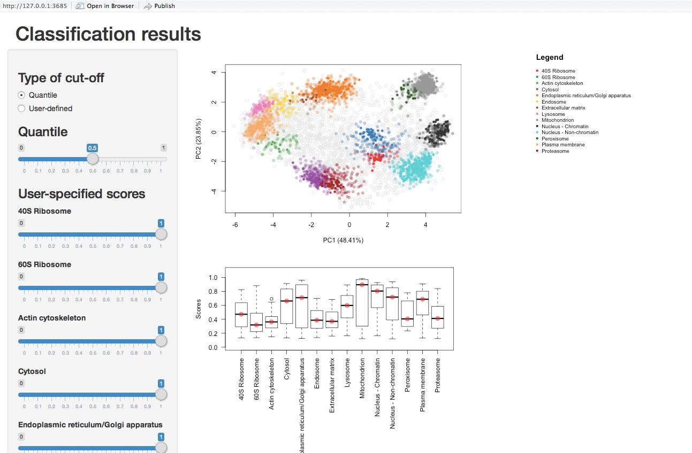

The data is loaded and displayed on a PCA plot and a boxplot is used to
display the classifier scores by data class. On the left there is
a sidebar panel with sliders to control the thresholds upon which classifications 
are made. There are two types of cut-off that the user can choose from: (1)
"Quantile" and (2) "User-defined". By default, when the application is launched
quatile scoring is selected and set to 0.5, the median. The 
class-specific score thresholds that correspond to selecting the desired
quantile are shown on as red dots on the boxplot. The assignments on the PCA
plot are also updated according to the selected threshold. The quantile 
threshold can be set by moving the corresponding quantile slider. If one
wished to set their own cut-offs the "User-defined" radio button must be selected
and then the sliders for defining user-specified scores become active and the
scores and highlighted on the boxplot by blue dots. 

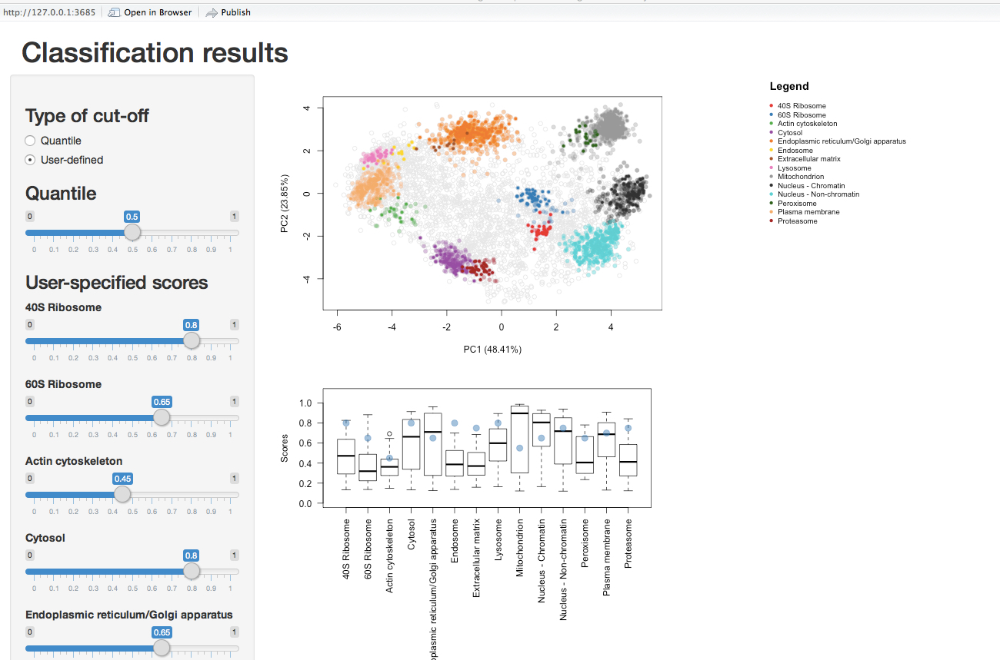

By default, when user-specified
scores are selected all sliders are set to 1 and can be changed by moving 
the sliders to the desired score. Once the desired score has been found the
application can be closed and the class-specific scores are displayed in the
R console. These scores can be used to get protein localisation predictions
using the `getPredictions` function, as demonstrated below:

```{r score, eval=FALSE}
mythreshold <- pRolocVis(object = res, what = "classify", fcol = "svm") 
res <- getPredictions(res, fcol = "svm", 
                      mcol = "markers", t = mythreshold)
```

The classification app can also be used as an intercative version of 
the function `orgQuants` in the `r Biocpkg("pRoloc")` package.

# The `compare` application

The comparison application may be of interest if a user wishes to 
examine two replicate experiments, or two experiments from different
conditions etc.  Two PCA plots are loaded side-by-side and one can
search and identify common proteins between the two data sets.

A `MSnSetList` of length 2 must be supplied as input, containing
the two datasets one wishes to compare. In the example below
we load two replicate datasets of mouse embryonic stem cells 
produced using the hyperLOPIT technology.

```{r compare, eval = FALSE, echo = TRUE} 
data(hyperLOPIT2015ms3r1)
data(hyperLOPIT2015ms3r2) 
mydata <- MSnSetList(list(hyperLOPIT2015ms3r1, hyperLOPIT2015ms3r2))
pRolocVis(mydata, what = "compare") 
```

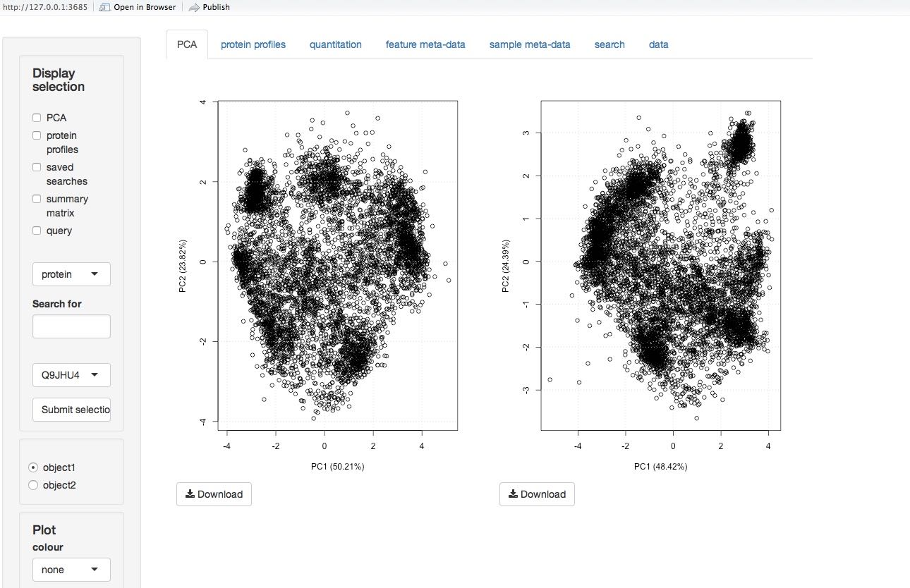
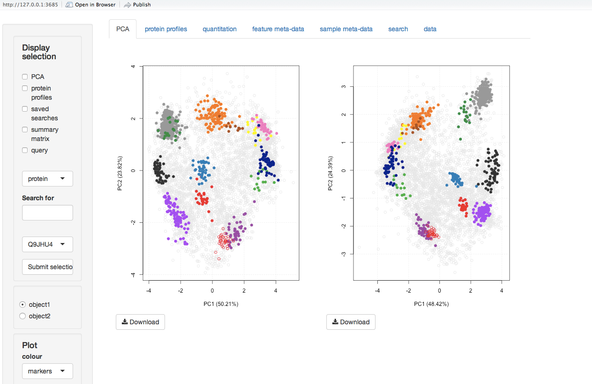

**Viewing, remapping, searching and zooming**
The compare app has the same functionality as the main application and
PCA, Profiles and Table Selection tabs. One key feature of the compare
application is the ability to re-map the second dataset onto the PCA data
space of the first (reference) data set (see `?pRolocVis` and the argument `remap = TRUE`). 

Currently, only PCA is supported and re-mapping is done by default. This can 
be switched off with the `remap` argument. Using the first dataset as the
reference set, PCA is carried out on the first dataset and the standard 
deviations of the principal components (i.e. the square roots of the 
eigenvalues of the covariance/correlation matrix) and the matrix of 
variable loadings (i.e. a matrix whose columns contain the eigenvectors) are
stored and then used to calculate the principal components of the second 
dataset. Both datasets are scaled and centered in the usual way. The
first dataset appears on the left, and the second re-mapped data appears on the right. 
The order of the first (the reference data for remapping) and second dataset 
can be changed through regeneration/re-ordering of the `MSnSetList` object. 
Note: the proteins that are common in both datasets are only displayed.

As per the main application, and described in detail above, there is a sidebar with a 
'Labels' menu, where input can be selected by clicking on and off
the data class names. Proteins of interest can be highlighted by double clicking
on any of the PCA plots (and highlighted in both datasets on both PCA plots), or
by typing and  searching in the white input box above the data table and clicking
on the protein of interest in the data table. Zooming, clicking and searching
for proteins of interest is supported as per the main app.


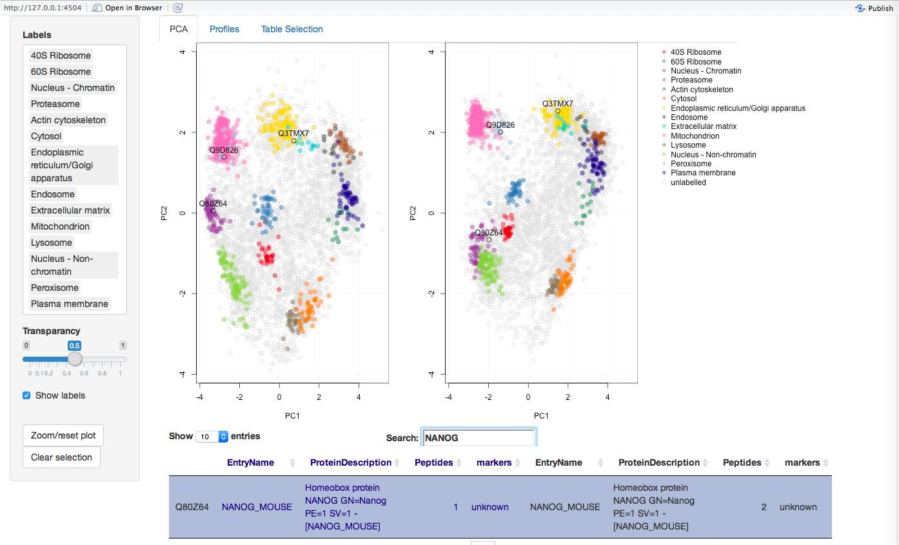
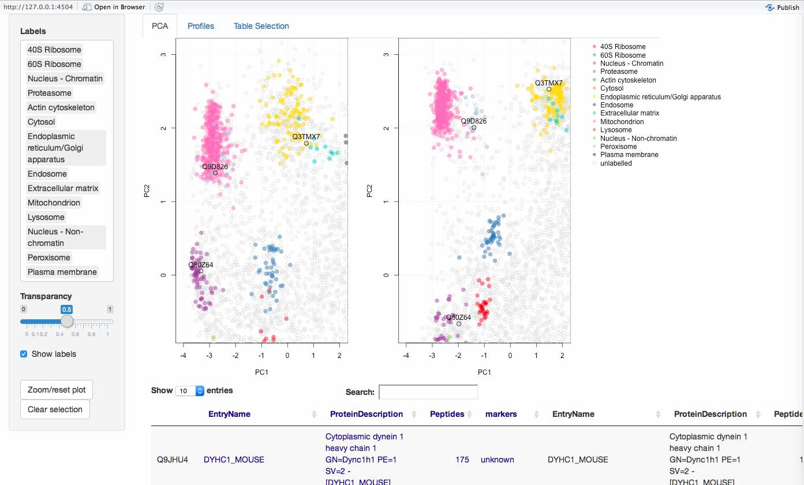

**Profiles**
As per the main application there is a profiles tab which loads the
quantitative protein profiles for the first experiment and second
experiment, on the left- and right-hand sides respectively. One
can highlight proteins of interest by clicking items in the data 
table, and selecting classes to display in the side panel under the
'Labels' menu.

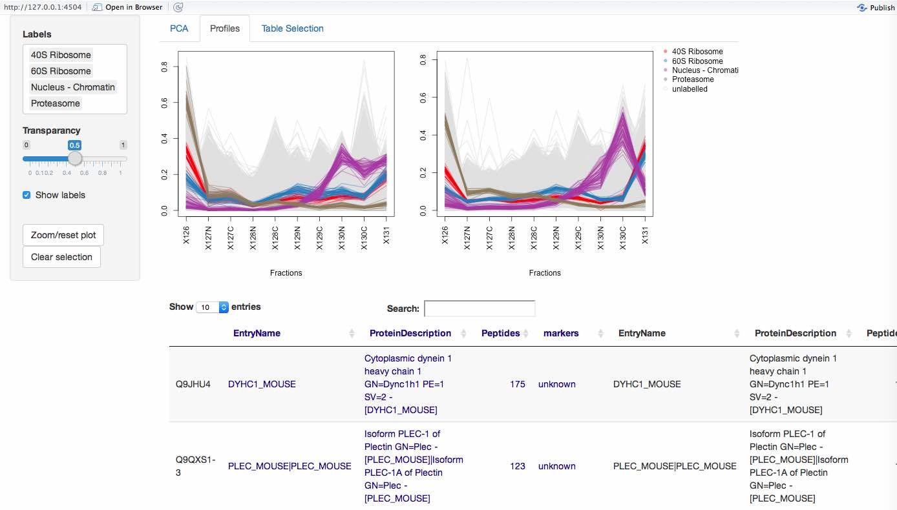

**Table Selection**
By default 4 columns containing the feature data the first dataset 
(dark blue) and 4 columns for the second dataset (black) will be displayed 
in the table, and users can select particular columns they wish to display
in the Table Selection tab.


## References

Gatto L., Vizcaíno J.A., Hermjakob H., Huber W. and Lilley K.S.
*Organelle proteomics experimental designs and analysis* [Proteomics,
10:22, 3957-3969, 2010](http://www.ncbi.nlm.nih.gov/pubmed/21080489).

Gatto L., Breckels L.M., Burger T., Nightingale D., Groen A.J.,
Campbell C., Nikolovski N., Mulvey C.M., Christoforou A., Ferro M.,
Lilley K.S. *A foundation for reliable spatial proteomics data
analysis*,
[Mol Cell Proteomics. 2014 Aug;13(8):1937-52](http://www.ncbi.nlm.nih.gov/pmc/articles/PMC4125728/).

Christoforou A., Mulvey C.M., Breckels L.M., Hayward P.C., Geladaki
E., Hurrell T., et al. *A draft map of the mouse pluripotent stem cell
spatial
proteome*. [Nat Commun. 2016 Jan 12;7:9992](http://www.nature.com/ncomms/2016/160112/ncomms9992/full/ncomms9992.html).

