<!--
%\VignetteEngine{knitr::knitr}
%\VignetteIndexEntry{pRolocVis application}
%\VignetteIndexEntry{pRolocComp application}
%\VignetteKeywords{Visualisation, Organelle, Spatial, Proteomics, Shiny}
%\VignettePackage{pRolocGUI}
-->


```{r, eval=TRUE, echo=FALSE, warning=FALSE, message=FALSE}
library(knitcitations)
cite_options(linked = FALSE)
extbib <- read.bib("pRolocGUI.bib")

```


<h1>pRolocGUI: Interactive visualisation of organelle (spatial) proteomics 
data</h1>


#### Thomas Naake and Laurent Gatto*

#### *Computational Proteomics Unit, University of Cambridge

### Foreword

This vignette describes the implemented functionality in the
`pRolocGUI` package. The package is based on the `MSnSet` class
definitions of `MSnbase` [`r citep(extbib["GattoLilley2012"])`](#references)
and on the functions defined in the package `pRoloc` 
[`r citep(list(extbib["Breckels2013"], extbib["Gatto2014"]))`](#references). 
`pRolocGUI` is intended for the visualization and analysis of proteomics data,
especially for the analyses of 
LOPIT [`r citep(extbib["Dunkley2006"])`](#references)
or PCP [`r citep(extbib["Foster2006"])`](#references) experiments.  
To achieve reactivity and interactivity, `pRolocGUI` relies on the
[`shiny`](http://www.rstudio.com/shiny/) framework.  

The implemented application facilitates a higher degree of interactivity 
with the underlying spatial proteomics data: The distributed functions 
`pRolocVis` and `pRolocComp` offer interactive 
Principal Component Analysis (PCA) plots and 
protein profile plots, as well as exploration of quantitative and 
qualitative meta-data. 
Key features of `pRolocVis` and `pRolocComp` are the identification of 
features in plots, a 'reverse search' based on querying meta-data which 
allows for highlighting the features on plots and an import/export 
functionality by using the `FeaturesOfInterest`/`FoICollection` infrastructure 
distributed by the `MSnbase` package. Additionally, `pRolocComp` allows for 
comparison of two comparable `MSnSet` instances, e.g. this might be of great 
help for analyses of changes in protein localisation in different `MSnSet`s.

We recommend some familiarity with the `MSnSet` class (see `?MSnSet`
for details) and the `pRoloc` vignette (available with 
`vignette("pRoloc-tutorial")`).

`pRolocGUI` is under active development; current functionality is
evolving and new features will be added. This software is free and
open-source. You are invited to contact Thomas Naake (thomasnaake@gmx.de) or 
Laurent Gatto (lg390@cam.ac.uk) in case you have any questions, suggestions or 
have found any bugs or typos. To reach a broader audience for more general 
questions about proteomics analyses using R consider of writing to the 
Bioconductor list.


-------------------
<a id="introduction"></a> 

<h2>1. Introduction</h2>


Currently, `pRolocGUI` distributes the `pRolocVis` and `pRolocComp`application.  

The function `pRolocVis` needs an object of class `MSnSet` or 
a list of `MSnSet` objects as an argument, while `pRolocComp` needs a list 
containing two instances of class `MSnSet`. 
To prepare the environment to run a `pRolocVis`/`pRolocComp` session, 
the `pRolocGUI` package and for demonstration purposes four example `MSnSet`s 
are loaded to the environment. The example data sets are available from the 
`pRolocdata` [`r citep(extbib["GattoPRolocdata"])`](#references) experiment
package and are derived from experiments `andy2011` from 
[`r citet(extbib["Breckels2013"])`](#references), `tan2009r1` and `tan2009r2`, 
the first and second replicate from [`r citet(extbib["Tan2009"])`](#references)
and `dunkley2006` from [`r citet(extbib["Dunkley2006"])`](#references).  

```{r, echo = TRUE, message = FALSE, warning = FALSE}
library("pRolocGUI")
data(andy2011, package = "pRolocdata")
data(tan2009r1, package = "pRolocdata")
data(tan2009r2, package = "pRolocdata")
data(dunkley2006, package = "pRolocdata")
```

`pRolocVis` needs an object of class `MSnSet` as an argument. We can launch the
application with an `MSnSet` by assigning it to the argument `object`:
```{r, eval = FALSE, echo = TRUE}
pRolocVis(object = andy2011)
```

Alternatively, to upload multiple objects of class `MSnSet`, `pRolocVis` 
accepts both lists with named and unnamed objects. This allows for analysis
of multiple data sets without stopping the application from running. 
The names of objects of lists will appear in the drop-down menu in the 
**_Data_** tab, while lists with unnamed objects will have a drop-down menu 
with automatically named entries as a consequence, i.e. object1 ... objectn, 
where n is the length of the list. 
```{r, eval = FALSE, echo = TRUE}
named <- list(andy2011 = andy2011, tan2009r1 = tan2009r1, dunkley2006 = dunkley2006)
unnamed <- list(andy2011, tan2009r1, dunkley2006)
pRolocVis(object = named)
pRolocVis(object = unnamed)
```

`pRolocComp` requires a list of two `MSnSet`s which can be named or unnamed. 
```{r, eval = FALSE, echo = TRUE}
named <- list(tan2009r1 = tan2009r1, tan2009r2 = tan2009r2)
unnamed <- list(tan2009r1, tan2009r2)
pRolocComp(object = named)
pRolocComp(object = unnamed)
```

N.B.! It is also possible to use a partly named list in `pRolocVis` and 
`pRolocComp`.

Launching `pRolocVis` or `pRolocComp` will open a new tab in your default 
Internet browser.  


To stop the applications from running press `Esc` or `Ctrl-C` in the
console (or use the "STOP" button when using RStudio) and close the
browser tab, where `pRolocVis`/`pRolocComp` is running.

-------------------
<a id="tabspRolocGUI"></a> 

<h2>2. Tabs of <code>pRolocVis</code> and <code>pRolocComp</code></h2>

To optimise ease of use the interfaces of `pRolocVis` and `pRolocComp` are
subdivided in seven tabs:  

* Data (at the last position for `pRolocComp`),  
* PCA,    
* protein profiles,  
* quantitation,  
* feature meta-data,  
* sample meta-data and  
* search.  

You browse through the tabs by simply clicking on them. Each tab
selected will have a different kind of appearance while some (PCA,
protein profiles, quantitation and feature meta-data) share a common
feature in the sidebar, the *Display selection* widget (see section
[3. Display selection widget](#display) for further details).  

In case you have a question and want to consult the vignette for a certain
issue (e.g. regarding **_PCA_** tab or on how to use the *Display selection* 
widget) click on `?` which will open the vignette in a new browser tab in the
corresponding section.  

In general, the tabs for `pRolocVis` and `pRolocComp` will look alike. The tab 
`Data` however differs for the two applications. While in `pRolocVis` this tab
allows for the selection of the used `MSnSet` and the upload of `.Rda` or 
`.Rdata` files, in `pRolocComp` there's the possibility to subset the used 
`MSnSet`s (in terms of using common, unique and common & unique features in the
two `MSnSet`s used) as well as submit features for selection. See
[2.1. Data](#tabspRolocGUIDataComp) for further details. 

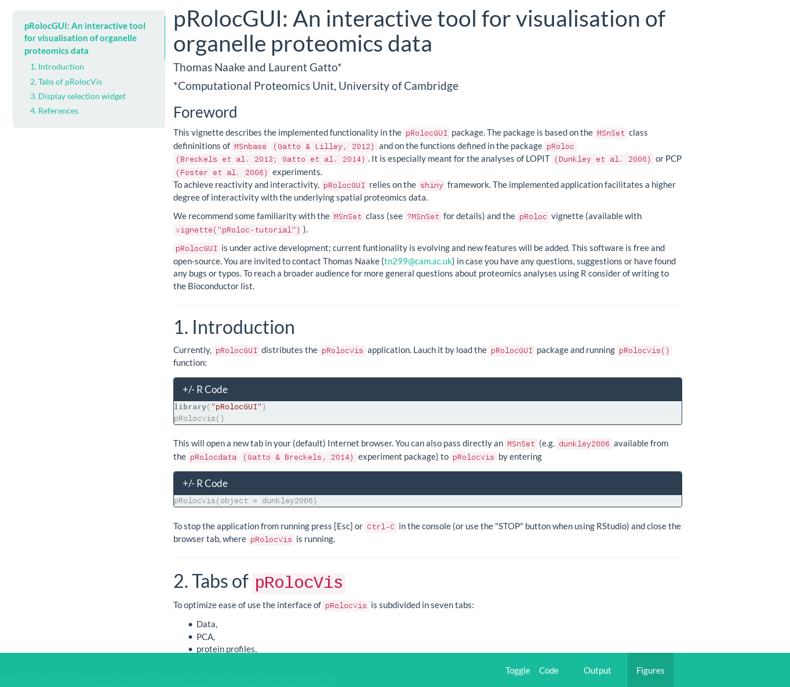 <p 
align="center"> Fig. 1: Vignette of pRolocVis </p>

<a id="tabspRolocGUIDataVis"></a>

### 2.1. Data

The tab **_Data_** is the first tab you will see when you start `pRolocVis` and 
the last for `pRolocComp`.

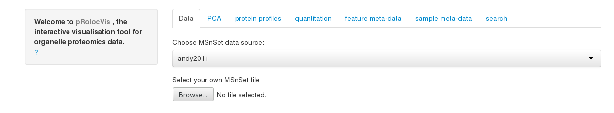 <p 
align="center"> Fig. 2: Appearance of `Data` tab in `pRolocVis` </p>

For `pRolocVis` the drop-down menu lists all the names of assigned `MSnSet` 
objects to the function. Depending if a named list containing `MSnSet` 
instances is uploaded or not these names will be used or automatic names will
be created (object1 ... objectn, where n is the length of the list).
In addition the entry `upload` is listed at the bottom 
of the drop-down menu. Selecting `upload` allows to use a 
`MSnSet` available in a `.Rda` or `.Rdata` file after uploading it to the 
application. Clicking on **_Browse..._** will open a dialog window with 
which you can select a file containing a saved `MSnSet` and load 
it to `pRolocVis`. Make sure if you want to use a `MSnSet` from a `.Rda` or 
`.Rdata` file to select `upload` in the drop-down menu. 

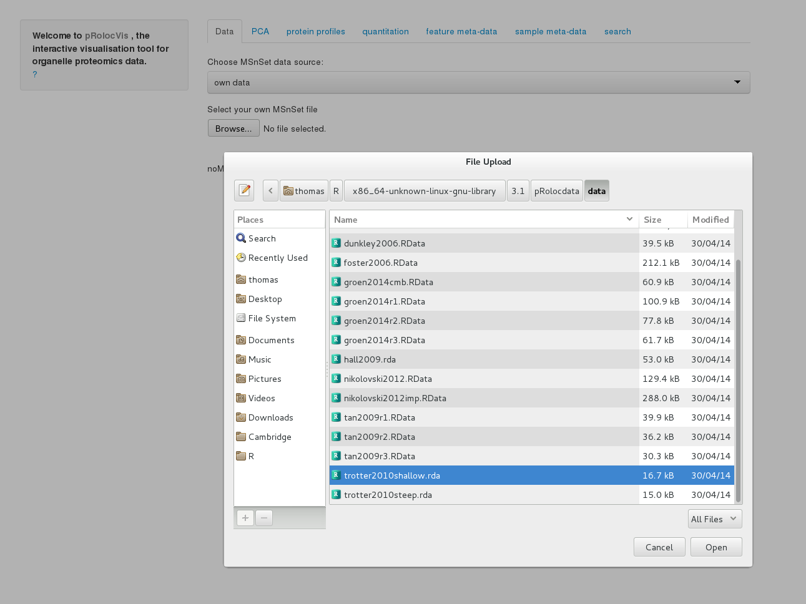 <p 
align="center"> Fig. 3: File upload in `pRolocVis` </p>

`pRolocVis` will print a message if there are any conflicts with the uploaded 
file. If so, either the assigned object itself or the first element in the list
will be used instead of the uploaded `.Rda` or `.Rdata` file. 

When analysing multiple data sets in one `pRolocVis` session the selected 
features will be (irreversibly) deleted when changing from one 
`MSnSet` to the other! It is therefore highly recommended if this
behaviour is not intended to save selected features by using the 
functionality to save features in a `FoICollection` first before changing the
`MSnSet` (see [2.7. search](#tabspRolocVisSearch) for further details).

<a id="tabspRolocGUIDataComp"></a>

For `pRolocComp` the main panel shows a summary matrix of common and unique
feature names consisting of common and unique features
for all feature names of the two `MSnSet` instances (row `all`) and for 
distinct subsets which are defined by the feature variable names. The feature
variable names can be defined by choosing appropriately the drow-down menus
**_marker level 1_** and **_marker level 2_** which are located in the 
sidebar panel (enter `?FeatComp` to retrieve more information about the summary
matrix). 

Features can be selected and [displayed](#display) in the other tabs. The 
selection is made by selecting a marker via the drop-down menu 
**_select marker_** and the radio buttons underneath. The selected row, 
column and the number of features which is comprised in these categories
will be displayed in bold in the summary matrix. By pressing 
**_Submit selection_** the features will be saved internally
(the button will be only shown when the features are not already stored 
internally). 

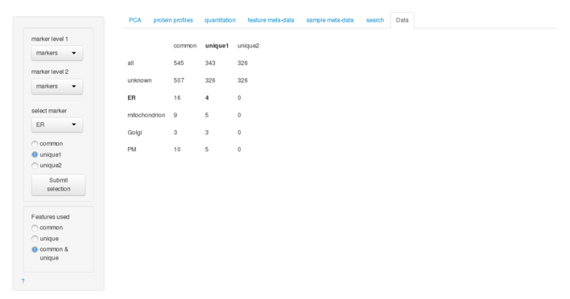</img> <p 
align="center"><Fig. 4: Appearance of `Data` tab in `pRolocComp`></p>

The tab **_Data_** in `pRolocComp`also allows for subsetting the data sets by 
choosing accordingly `common`, `unique` and `common & unique` (default). The 
subset is made on the basis of the feature names of the two `MSnSet` instances. 
Selecting `common` will use only features which occur in both `MSnSet`s,
`unique` will use no common features and `common & unique` will use all 
feature names for each `MSnSet`.  

<a id="tabspRolocGUIPCA"></a>

### 2.2. PCA

The tab **_PCA_** is characterised by its main panel which shows a
PCA plot for the selected `MSnSet` in the case of `pRolocVis`
and two PCA plots for `pRolocVis`. The sidebar panel is divided into 
*Display selection* and *Plot*.

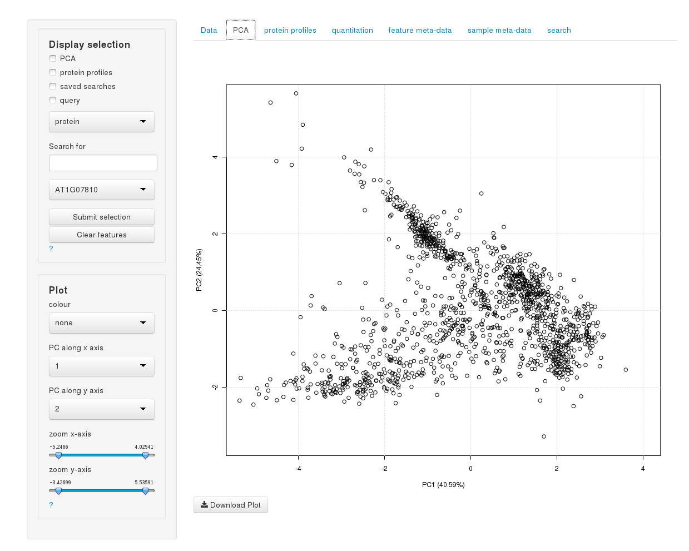 <p 
align="center"> Fig. 5: Appearance of `PCA` tab for `pRolocVis` (`andy2011`)</p>

For `pRolocComp` the plot whose appearance is going to altered has to be selected
by selecting the appropriate [radio button](#RadioButtons) left of the name of 
the `MSnSet` instance in the sidebar panel. 

<a id="RadioButtons"></a>
<center>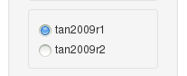</center> 
<p align="center">Fig. 6: Radio buttons to select `MSnSet` in `pRolocComp` </p>

The manipulation of the plots works the same way for `pRolocVis` and for 
`pRolocComp`:

The *Display selection* widget is described [below](#display). The
*Plot* compartment enables to adjust the appearance of the PCA plot
in the main panel. We are able to colour features (proteins) in
matters of common properties by changing the drop-down list
**_colour_**. These properties are the `MSnSet`'s feature
variables. For example if we upload the `andy2011` data set in `pRolocVis`, 
and select the colour `markers`, the features in the PCA plot will be coloured
according to their organelle affiliation. As soon as we select another
colour than `none`, two (or three) new items will be added to the
*Plot* widget:  

(1) **_symbol type_**: By selecting one of the feature variables of the
`MSnSet` in the drop-down list of **_symbol type_** the symbol type of 
the features in the plot will be changed.  

(2) **_legend_** and **_position of legend_**: By clicking on the
check box to the left of **_legend_** a legend is added to the plot
and by choosing one of the items in the drop-down list
**_position of legend_** below its position will be changed.  

(3) **_point size_**: This drop-down list might appear when
numeric feature variable have been identified.  The default 1
allows for an unaltered display of the plot, while selecting other
items in the list renders the features in the PCA plot according to
their numerical value in the variable label (for example
classification scores).

 <p
align="center"> Fig. 7: Appearance of PCA tab (`andy2011`). markers
used for colours, legend added. </p>


By changing the drop-down lists of the items 
**_PC along x axis_** and 
**_PC along y axis_** the x-values and y-values, 
respectively, the plot will be rendered according to the new principal 
components.

To zoom in and out drag and drop the little arrows of the slider
of the items **_zoom x-axis_** and **_zoom y-axis_**. This may be of great 
help when you want to identify points in dense clusters.

By clicking on **_Download Plot_** in the main panel below the PCA
plot will open a dialog window with an interface on showing or saving
the PCA plot as it is displayed in the main panel.


<a id="tabspRolocGUIPP"></a>

### 2.3. protein profiles

For `pRolocVis` the tab **_protein profiles_** shows the protein profiles in 
the main panel (with an option of exporting the plot as it is shown in the main
panel by clicking on the button **_Download Plot_**) - for `pRolocComp` it shows
the plots for the two `MSnSet` instances (the corresponding plot(s) for the 
first element in the list will be displayed on the left, 
for the second element on the right). In the sidebar panel there is the 
*Display selection* widget and the *Plot* widget. 

Have a look on section [3. *Display selection* widget](#display) if 
you want to retrieve information about how to use the *Display selection* 
widget.

The *Plot* widget helps to manipulate the plots shown in the main
panel (in `pRolocComp` one has first to select the appropriate 
[radio button](#RadioButtons) next to the `MSnSet` instance in the sidebar 
panel). Let's assume we want to have a look upon the protein profiles
for the proteins from which we know that they belong to the organelles
Endoplasmic reticulum, the Golgi apparatus, Mitochondrion and the
plasma membrane for the `andy2011` MSnSet. This is done in `pRolocVis`, but 
works in the same way in `pRolocComp`. We have four organelles to look
at, so we select `4` (in `pRolocComp` there is either the possibility to 
select `1` or `2` plots per `MSnSet`) in the drop-down list 
**_number of plots to display_**.  We will select the feature variable
`markers` in the drop-down list **_feature(s) in_** and select `ER` 
(coding for Endoplasmic reticulum)
in the drop-down list underneath (**_assigned to_**). To
display the next plot we have to change the slider **_Selected plot_**
to position 2. Accordingly to our question we will 
change the second drop-down list to `Golgi` (coding for Golgi apparatus). We
proceed with the two remaining organelles as described before by
changing firstly the slider to the next position and by changing the
drop-down lists accordingly to the organelles we want to
display. Please be aware that it is possible to "go" back to a plot to
change its parameter.


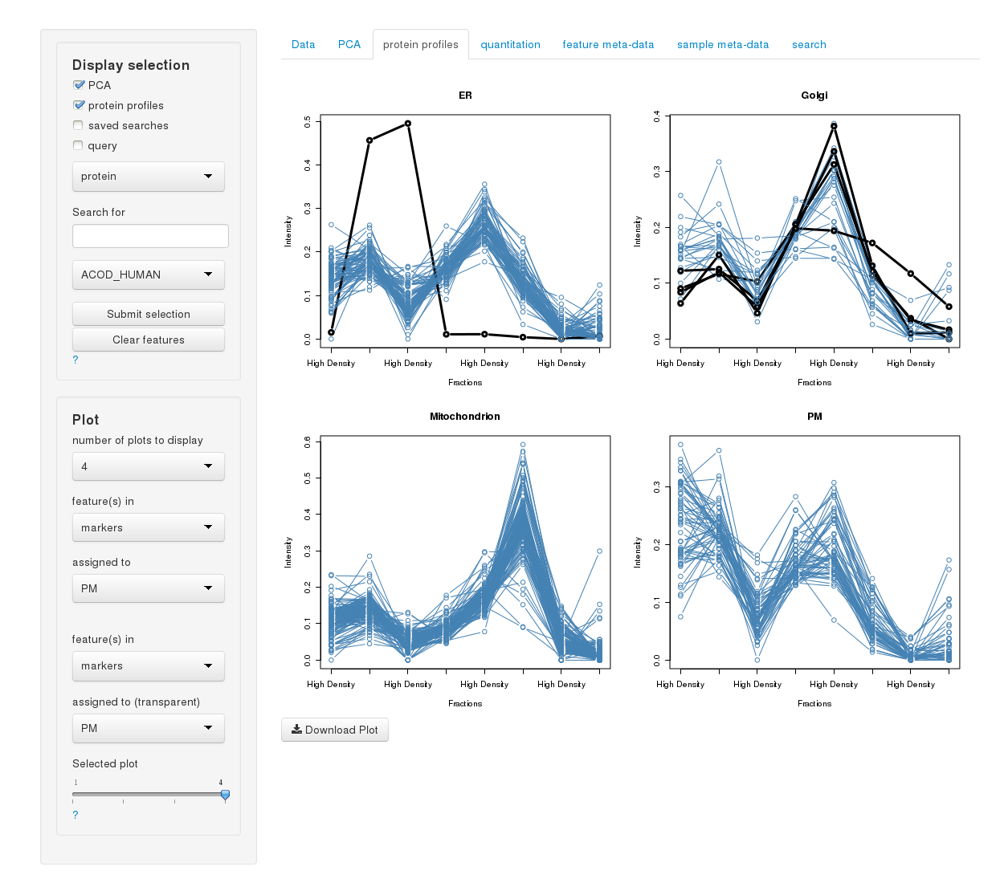 <p 
align="center"> Fig. 8: Appearance of `protein profiles` tab in `pRolocVis`
showing protein profiles  of organelles/compartments 
Endoplasmic reticulum, Golgi apparatus, Mitochondrion and plasma 
membrane of markers (`andy2011`) </p>


<a id="tabspRolocGUIExprs"></a>

### 2.4. quantitation   

The tab **_quantitation_** displays the quantitation data for the proteins 
as a data table. 

In the main panel you can change the number of proteins shown per page and 
search both for proteins (or for the quantitation data). 
Also, you may sort the proteins by name or the quantitation data by clicking 
on the arrows on the top of the data table.

In the sidebar panel the *Display selection* widget is located as well as 
radio buttons to display all data or just selected features 
(see [3. *Display selection*](#display) for further details). In `pRolocComp` 
there is also another well panel to select the appropriate 
[radio button](#RadioButtons) next to the name of the `MSnSet` to show the 
respective quantitation data. 

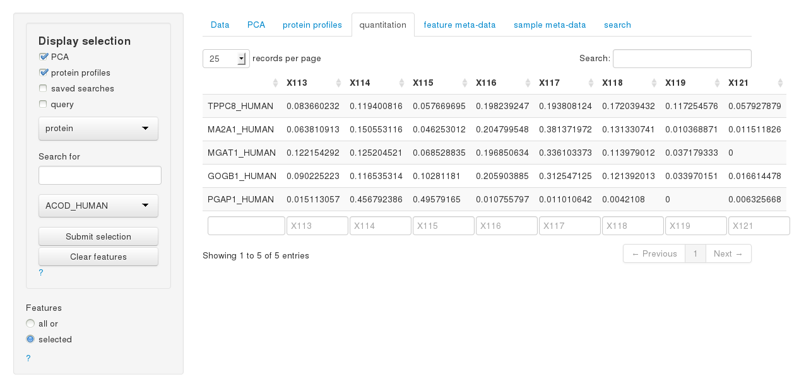 <p
align="center"> Fig. 9: Appearance of `quantitation` tab
(`andy2011`) in `pRolocVis`. Features shown originate from selection made in 
the PCA and protein profiles plots </p>


<a id="tabspRolocGUIfData"></a>

### 2.5. feature meta-data  

The tab **_feature meta-data_** displays the feature meta-data for 
the proteins as a data table.

The layout of the tab is similar to the **_quantitation_** tab
and allows for sorting and querying the feature meta-data of the 
selected `MSnSet`.  

The sidebar comprises the *Display selection* widget and radio buttons to 
show all or only selected features (see [3. *Display selection*](#display) 
for further details). In `pRolocComp` there is in addition a set of two 
[radio buttons](#RadioButtons) which allow to switch the `MSnSet` shown, 
thus, the feature meta-data will be rendered to the selected `MSnSet`.


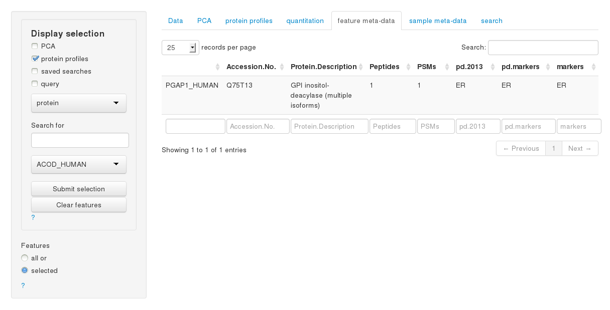 <p
align="center"> Fig. 10: Appearance of `feature meta-data` tab
(`andy2011`) in `pRolocVis`. Features shown originate from selection made in 
protein profiles plot </p>


<a id="tabspRolocGUIpData"></a>

### 2.6. sample meta-data   

The tab **_sample meta-data_** displays the sample meta-data for the 
experiment, the name of the isotopes used for tagging and the associated
fractions. 

In `pRolocComp` select the appropriate [radio button](#RadioButtons) next to 
the object name in sidebar panel to display the corresponding sample meta-data. 

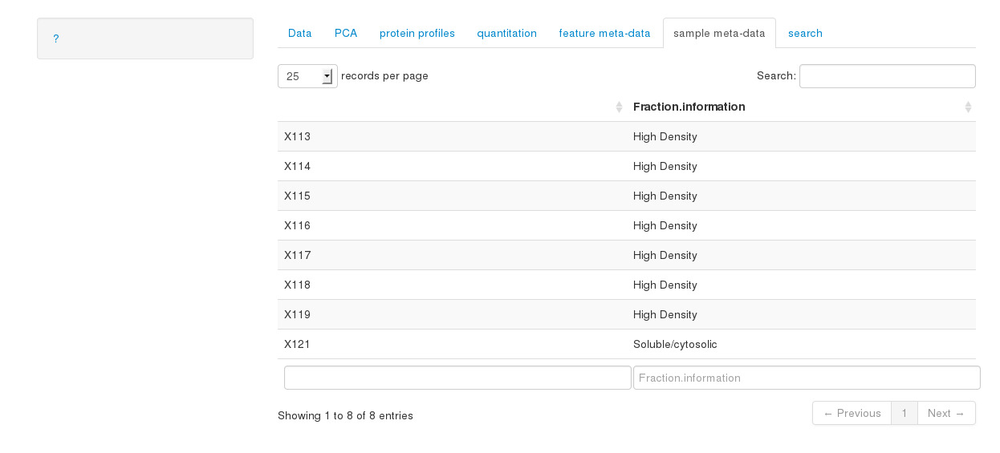 <p
align="center"> Fig. 11: Appearance of `sample meta-data` tab
(`andy2011`) in `pRolocVis`</p>

<a id="tabspRolocGUISearch"></a>

### 2.7. search  

The appearance and operation are identical for `pRolocVis` and `pRolocGUI`.

`pRolocVis` and `pRolocComp` allow to use past search results to display in the 
PCA plot, protein profiles and in the tabs **_quantitation_** and
**_feature meta-data_** (see [3. *Display selection*](#display) 
for further details if this is your intention). 
This ability requires the object
`pRolocGUI_SearchResults` in the global environment which is of
class `FeaturesOfInterest` or `FoICollection` (enter
`?FeaturesOfInterest` in the console for further details).

In case this objects exists it will automatically be loaded to
`pRolocVis`/`pRolocComp` and its content is displayed in the tab **_search_**. 
Use the drop-down list in the sidebar panel to browse through the
different features of interest in case the object is of class
`FoICollection`.

If no object called `pRolocGUI_SearchResults` exists in the global
environment you still have the possibility to assign `FeaturesOfInterest`
to an `FoICollection` which will be assigned to the global environment when 
exiting `pRolocVis`/`pRolocComp`. 

To save features of interest to the object internally you need
to select features and add these to the `FoICollection` by entering an 
appropriate description in the text field (on the sidebar panel, which will
be useful to trace back to the underlying features and does not exist yet in 
the `FoICollection`). Add the selected features to the object 
`pRolocGUI_SearchResults` in the global environment by clicking on 
**_Create new features of interest_**. You only have the possibility to
add selected features to the `FoICollection` when you have entered an 
appropriate description, i.e. one that doesn't exist yet in the 
`FoICollection` and if you have selected `FeaturesOfInterest`, otherwise
the button does not show up in the application.

When exiting `pRolocVis`/`pRolocComp` the `FoICollection` will be assigned to 
the object `pRolocGUI_SearchResults` in the global environment. 

To create an example object `pRolocGUI_SearchResults` containing the 
first ten features of `tan2009r1` run the following commands in the console. 
Both traceable and non-traceable `FeaturesOfInterest`/`FoICollection` are 
usable by `pRolocVis`/`pRolocComp`.

```{r, eval = TRUE, echo = TRUE}
data(tan2009r1, package = "pRolocdata")
pRolocGUI_SearchResults <- FoICollection()
newFeat <- FeaturesOfInterest(description = "test_01",
                              fnames = featureNames(tan2009r1)[1:10],
                              object = tan2009r1)
pRolocGUI_SearchResults <- addFeaturesOfInterest(newFeat, pRolocGUI_SearchResults)
```

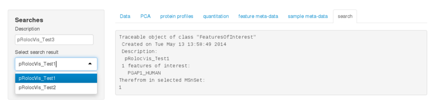 <p
align="center"> Fig. 12: Appearance of `search` tab (`andy2011`) in `pRolocVis`. 
Search result `pRolocVis_Test1` contains one feature of interest 
(PGAP1_Human)
</p>

-------------------
<a id="display"></a>

<h2>3. <i>Display selection</i> widget</h2>


The *Display selection* widget is probably the most important implementation 
in `pRolocVis`/`pRolocComp` and allows for identifying features. 
You can do this by selecting points in the PCA plot, clicking on features 
in the tab **_protein profiles_**, using past searches and/or querying for 
features in the `MSnSet` data. In `pRolocComp`there is in addition the 
possibility to retrieve features from the summary matrix in the tab `Data`.

There are four (`pRolocVis`) or five (`pRolocComp`) check boxes in the
*Display selection* widget which represent the before mentioned ways
of searching features in the `MSnSet`. To activate the search for one
specific method click on the check box left of its description. It is
also possible to select more than one at a time which allows for
greater flexibility with regard to information retrieval.

<a id="displayPCA"></a>

### 3.1. PCA 

If you decide to identify proteins in the PCA plot, change to the tab
**_PCA_** and start clicking on features in the PCA plot (tip: the
zoom function may be of great expedient). When hovering over the PCA plot 
the name of the nearest feature will be displayed below the plot. 
The check box will be checked when you start clicking in the PCA plot. 
As soon as you have clicked on a feature it will be marked with a 
black circle around it (or a blueish if `colour` is set to `none`).
If you have selected a feature by accident or want to deselect it,
just click again on the feature and it will be deselected.

Selecting features works also in `pRolocComp`: just click on features in one of 
the PCA plots will also highlight the same feature in the other plot if it is 
present. If you want to analyse features which are only common in the two 
`MSnSet` instances, go to tab **_Data_** and select `common` in the 
radio button list **_Features used_**. 

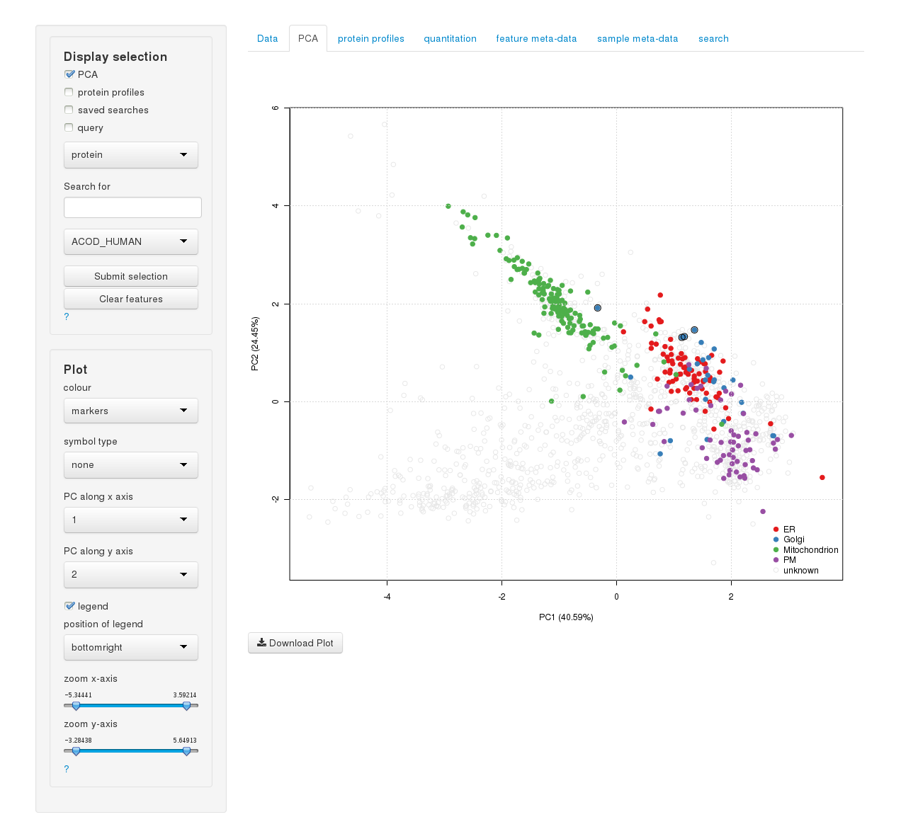 <p
align="center"> Fig. 13: Display of selected features in PCA plot
(`andy2011`) for `pRolocVis`. The features selected originate from selection 
in the PCA plot </p>

There are two possibilities to deselect all selected features: If you
decide to remove all your features click on **_Clear features_** 
(the button will only show up if features were already selected).
Please keep in mind that this step once carried out is
irreversible. Besides that you are also able to simply blind out the
selected features by deselecting the check box left of PCA in the
*Display selection* widget. Internally, the features are still
stored, i.e. by clicking again on the check box you will see the
selections again. Clicking on new proteins in the PCA plot will not
check the check box again, so you have to do this manually. The
features selected are shared between the different tabs. Click on the
tabs **_quantitation_** and **_feature meta-data_** to have a look
upon information about the selected features. For the case where you
see all features in the data table change the radio buttons settings
from **_all_** to **_selected_** at the lowermost widget in the
sidebar. Here again, you can compose the features from different
sources (PCA, protein profiles, saved searches and the text-based
query search).

If you display protein profiles in the tab **_protein profiles_**
selected features will be displayed by black lines on all plots 
drawn.

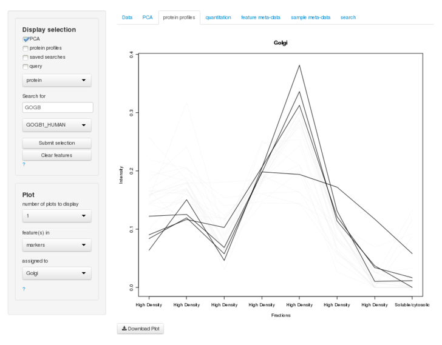 <p
align="center"> Fig. 14: Display of selected features in protein
profiles plot for `pRolocVis`.  The features selected originate from 
selection in PCA plot (`andy2011`) </p>


<a id="displayPP"></a>

### 3.2. protein profiles

In principle the search for features in protein profiles is in
accordance with the search in the PCA plot. Though, bear in mind that
you are only able to select features when `1` is selected in the
drop-down list **_number of plots to display_**. Hovering over the 
plot will display the nearest protein below the plot. Clicking on (or near)
the points in the plot will select, clicking another time will
deselect features.  The features will only be shown when the check box
left of **_protein profiles_** is activated. Note, that you can only 
select or deselect features whose protein profiles are displayed in a 
transparent manner on the plot. 

For `pRolocComp` selecting features works in the same way: click on features in 
one of the protein profile plots (make sure that `1` is selected in the 
drop-down list **_number of plots to display_**), thus highlighting
the same feature in the other plot if the same feature name is present. 
If you want to analyse features which are only common in the two 
`MSnSet` instances, go to tab **_Data_** and select `common` in the 
radio button list **_Features used_**. 

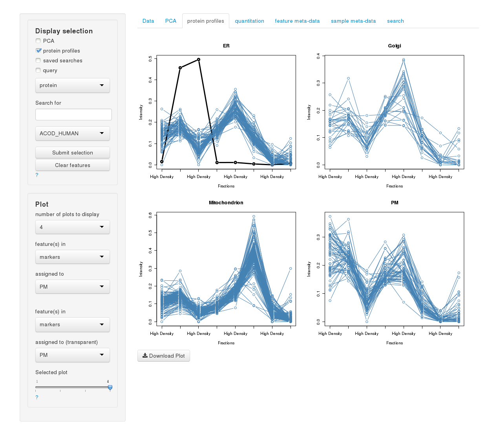 <p
align="center"> Fig. 15: Display of selected features in protein
profiles plot for `pRolocVis`.  The features selected originate from selection 
in protein profiles plot (`andy2011`) </p>

<a id="displaySaSe"></a>

### 3.3. saved searches

Clicking on the check box to the left of **_saved searches_** will
load the selected features of the class `FeaturesOfInterest`. These
will be displayed in the PCA plot, in the plots for protein profiles
(depending on the displayed features) and will be available in the
tabs **_quantitation_** and **_feature meta-data_** for information
retrieval.  If there is an `FoICollection` loaded change the selected
search result in the drop-down list **_Search result_** in the tab
**_search_**; thus accordingly altering the selected features in the
*Display selection* widget context.

In `pRolocVis`/`pRolocComp` there is no functionality implemented to remove 
features from the object `pRolocGUI_SearchResults` in the global environment. 
The authors decided that it is not the task of a GUI to fulfil the requirements 
of this kind of data manipulation in a GUI, hence, the execution of removing
features of interests belongs to the field of the users responsibility.

<a id="displayData"></a>
### 3.4. summary matrix (pRolocComp only)

In `pRolocComp` another way of selecting and displaying features is possible
via the tab **_Data_**. Features can be selected and internally stored
by selecting a marker via the drop-down menu 
**_select marker_** and one of the radio buttons underneath and pressing the 
**_Submit selection_** button. The button will be only shown when the features 
are not already stored internally. The selected row, 
column and the number of features which is comprised in these categories
will be displayed in bold in the summary matrix. 

As an example, for the two `MSnSet`instances `tan2009r1` and `tan2009r2` a 
selection of `markers` and `markers` as **_marker level 1_** and 
**_marker level 2_**, when selecting `mitochondrion` in **_select marker_**
and the radio button next to `common` will be equivalent to and will contain the 
following features
```{r, eval = TRUE, echo = TRUE}
data(tan2009r1, package = "pRolocdata")
data(tan2009r2, package = "pRolocdata")
featcomp <- compfnames(x = tan2009r1, y = tan2009r2, fcol1 = "markers", fcol2 = "markers", verbose = FALSE)
## the fourth element in the list bears information about features which are assigned to 
## "mitochondrion" in "markers", we can access all common features for tan2009r1 and tan2009r2 by
feat <- slot(featcomp[[4]], "common") 
feat
```
The selection means that for the marker level "markers" there are nine common 
features comprised in the two data sets which are assigned to `Mitochondrion`

The stored features will only displayed when the check box next to `Data`
in the *Display selection* widget is selected. 

<a id="displayQuery"></a>

### 3.5. query feature-meta data

The *Display selection* widget offers the opportunity to query 
the feature meta-data
of the `MSnSet` for levels. The drop-down list consists of the item `protein`,
which is by definition the row name of the feature-meta data and depending on 
the data accession number, protein ID, protein description, assigned markers
(varying on the underlying `MSnSet`). 

For demonstration purposes we will use `pRolocVis` to select and display 
features by using the `query` functionality. Keep in mind, to adjust the 
selection of the [radio buttons](#RadioButtons) next to the appropriate 
`MSnSet` when using `pRolocComp`: Accordingly to the selected `MSnSet` the list 
of feature variables is rendered.

Let's assume we want to look at `andy2011` which was derived from
experiments of Breckels et al. (2013) for all proteins which are
assigned by experimental evidence to the organelle `plasma membrane`. 
We ensure ourselves that `andy2011` is selected in the tab
**_Data_** and change to a tab where the *Display selection* widget is
loaded. We select `marker` in the upper drop-down list (for we are looking for
organelles assigned to marker proteins). In the next drop-down list below we 
select `PM` which codes for `plasma membrane`. Next, we click on 
**_Submit selection_**, which will highlight all features which are assigned 
to `PM` for the variable name `marker` 
(the button only appears in the application when the corresponding proteins do 
not exist in the selection). To remove the selected features from the
internal assignment we have to reset the search by clicking on
**_Clear features_**. Of course, we can also add other features: If we
want to add all features which are assigned to the Golgi apparatus we
simply select `Golgi` in the lower drop-down list and click on
**_Submit selection_** to save internally the selected features.

It is relatively easy to find levels when the drop-down list for these
levels. But how should we proceed when we want to look for a special
protein, e.g. ACADV? The drop-down list for the variable name
`protein` is very long and it is time consuming to scroll through the
whole list and look for our protein of interest. Therefore, we can
just enter ACADV in the text input field **_Search for_** in between
the two drop-down lists and we will get the protein of interest (we
are also able to query for protein names which have the string `AC` in
their name which will limit the drop-down list to all proteins which
have this specific string). By clicking on **_Submit selection_** we
save internally the selected feature(s).

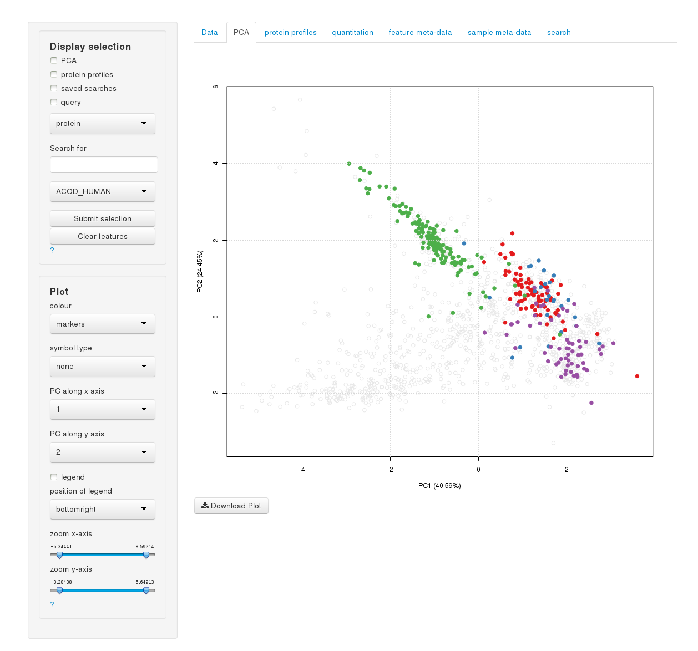 <p
align="center"> Fig. 16: Query for proteins in `pRolocVis` which contain the 
string "AC" which narrows the features in the drop-down list accordingly
(`andy2011`) </p>

-------------------
<a id="references"></a>

<h2>4. References</h2>


```{r, results="asis", message=FALSE, echo=FALSE}
bibliography(style = "markdown", sort = FALSE, 
  ordering = c("authors", "year", "title", "journal", "volume", "number",
  "pages", "doi", "url"))

```
