--- 
title: "pRolocGUI - Interactive visualisation of spatial proteomics data" 
author: 
- name: Lisa Breckels
  affiliation: 
    - Cambridge Centre for Proteomcs, Cambridge, UK 
- name: Thomas Naake
- name: Laurent Gatto
  affiliation: 
    - de Duve Institute, UCLouvain, Belgium
package: pRolocGUI
output:
  BiocStyle::html_document:
    toc_float: true
vignette: >
  %\VignetteIndexEntry{pRolocGUI - Interactive visualisation of spatial proteomics data} 
  %\VignetteEngine{knitr::rmarkdown}
  %\VignetteKeywords{Infrastructure, Bioinformatics, ontology, data}
  %\VignetteEncoding{UTF-8}
---

```{r env, echo=FALSE}
library("BiocStyle")
```

# Foreword

`r Biocpkg("pRolocGUI")` is under active development; current 
functionality is evolving and new features will be added. This 
software is free and open-source. You are invited to open issues 
in the [Github `pRolocGUI` repository](https://github.com/ComputationalProteomicsUnit/pRolocGUI/issues) 
in case you have any questions, suggestions or have found any bugs or typos. 
To reach a broader audience for more general questions about 
proteomics analyses using R consider of writing to the 
[Bioconductor Support Forum](https://support.bioconductor.org).


# Introduction

This vignette describes the implemented functionality of the
`pRolocGUI` package. The package is based on the `MSnSet` class
definitions of `r Biocpkg("MSnbase")` and on the functions defined in
the `r Biocpkg("pRoloc")` package. `r Biocpkg("pRolocGUI")` is
intended for, but not limited to, the interactive visualisation and
analysis of quantitative spatial proteomics data. To achieve
reactivity and interactivity, `pRolocGUI` relies on the
[`shiny`](http://www.rstudio.com/shiny/) framework. We recommend some
familiarity with the `MSnSet` class (see `?MSnSet` for details) and
the `pRoloc` vignette (see `vignette("pRoloc-tutorial")`) before using
`pRolocGUI`.

There are 3 applications distributed with `pRolocGUI` which are
wrapped and launched by the `pRolocVis` function. These 3 applications
are called according to the argument `app` in the `pRolocVis`
function which may be one of "explore", "compare" or
"aggregate". 

* The `explore` application launches a interactive spatial map 
(dimensionality reduction) of the data, with an alternate 
profiles tab for visualisation of protein profiles. There is a 
searchable data table for the identification of proteins of 
interest and functionality to download figures and export proteins 
of interest.
* The `compare` application features the same functionality as 
the `explore` app but allows the comparison of two 
`MSnSet` instances, e.g. this might be of help for the analyses of
changes in protein localisation in different conditions. 
* The `aggregate` application allows users to load peptide or
PSM level data and look at the relationship between peptides
and proteins (following aggregation).

## Getting started

Once R is started, the first step to enable functionality of the
package is to load it, as shown in the code chunk below.  We also load
the `r Biocpkg("pRolocdata")` data package, which contains
quantitative proteomics datasets.

```{r loadPkgs, message = FALSE, warning = FALSE} 
library("pRolocGUI")
library("pRolocdata")
```

We begin by loading the dataset `hyperLOPIT2015` from the `pRolocdata`
data package. The data was produced from using the hyperLOPIT
technology on mouse E14TG2a embryonic stem cells ([Christoforou et al 2016](http://www.nature.com/ncomms/2016/160112/ncomms9992/full/ncomms9992.html)). 
For more background spatial proteomics data anlayses please see 
[Gatto et al 2010](http://www.ncbi.nlm.nih.gov/pubmed/21080489), 
[Gatto et al 2014](http://www.ncbi.nlm.nih.gov/pubmed/24846987) and also the 
[`pRoloc` tutorial vignette](http://bioconductor.org/packages/release/bioc/vignettes/pRoloc/inst/doc/pRoloc-tutorial.html). 

```{r loadData, echo = TRUE, message = FALSE, warning = FALSE}
data(hyperLOPIT2015) 
```

To load one of the applications using the `pRolocVis` function and
view the data you are required to specify a minimum of one key
argument, `object`, which is the data to display and must be of 
class `MSnSet` (or a `MSnSetList` of
length 2 for the `compare` application). Please see
`vignette("pRoloc-tutorial")` or `vignette("MSnbase-io")` for
importing and loading data. The argument `app` tells the `pRolocVis`
function what type of application to load. One can choose
from: `"explore"` (default), `"compare"` or `"aggregate"`.  The optional 
argument `fcol` (and `fcol1` and `fcol2` for the compare app)
can be used which allows the user to specify the 
feature meta-data label(s) (`fData` column name(s)) to be plotted,
the default is `markers` (i.e. the labelled data).

For example, to load the default `pRolocVis` application:

```{r example, eval = FALSE, echo = TRUE} 
pRolocVis(object = hyperLOPIT2015, fcol = "markers") 
```

Launching any of the `pRolocVis` applications will open a new tab in a
separate pop-up window, and then the application can be opened in your
default Internet browser if desired, by clicking the 'open in browser'
button in the top panel of the window.

To stop the applications from running press `Esc` or `Ctrl-C` in the
console (or use the "STOP" button when using RStudio) and close the
browser tab, where `pRolocVis` is running.

## Which app should I use?  

There are 3 different applications, each one designed to address a 
different specific user requirement.

* The explore app is intended for exploratory data analysis, 
which features a clickable interface and zoomable spatial map.
The default spatial map is in the form of a PCA plot, but many other
dimensionality reduction techniques are supported including t-SNE
and MDS among others. If you would like to search for a particular 
protein or set of proteins this is the application to use. This 
app also features a protein profiles tab, designed for examining 
the patterns of user-specified sets of proteins. For example, if 
one has several overlapping sub-cellular clusters in their data, 
as highlighted by the PCA plot or otherwise, one can check for 
separation in all data dimensions by examining the protein profile 
patterns. Proteins that co-localise are known to exhibit similar 
distributions (De Duve's principale).

* The comparison application may be of interest if a user wishes to 
examine two replicate experiments, or two experiments from different
conditions etc.  Two spatial maps are loaded side-by-side and one can
search and identify common proteins between the two data sets. As per the 
default application there is also a protein profiles tab to allow one to look
at the patterns of protein profiles of interest in each dataset. 

* The aggregate app is for examining the effect that peptide or PSM 
aggregation may have on the protein level data. 

# The `pca` application

The `explore` (default) app is characterised by an interactive and
searchable spatial map, by default this is a Principal Components 
Analysis (PCA) plot. PCA is an
ordinance method that can be used to transform a high-dimensional
dataset into a smaller lower-dimenensional set of uncorrelated
variables (principal components), such that the first principal
component has the largest possible variance to account for as much
variability in the data as possible. Each succeeding component in turn
has the highest variance possible under the constraint that it be
orthogonal to the preceding components. Thus, PCA is particularly
useful for visualisation of multidimensional data in 2-dimensions,
wherein all the proteins can be plotted on the same figure. Other
dimensionality reduction methods are supported such as t-SNE, 
among others (please see `?plot2D` and the argument `method`)

The application is subdivided in to different tabs: (1) Spatial Map, 
(2) Profiles, (3) Profiles (by class), (4) Table Selection, (5)
Sample info and (6) Colour picker. A searchable data table containing 
the experimental feature meta-data is permanantly dispalyed at the bottom 
of the screen for ease. You can browse between the tabs by simply 
clicking on them at the top of the screen.

To run the `explore` application using `pRolocVis`: 

```{r pca1, eval = FALSE, echo = TRUE} 
pRolocVis(object = hyperLOPIT2015, fcol = "markers") 
```


**Viewing** The Spatial Map tab is characterised by its main panel which shows
a PCA plot for the selected `MSnSet`. By default a PCA plot is used to
display the data and the first two principal components are plotted.
The left sidebar panel controls what class labels (sub-cellular compartments) 
to highlight on the PCA plot. Labels can be selected by clicking on and off
the coloured data class names, or removed/highlighted by clicking the 
"Select/clear all" button. The right sidebar contains the map controls.
This features a 'transparancy' slider to control the opacity of the highlighted 
data points, and other buttons which are in detail below. 

**Searching** Below the spatial map is a searchable data table containing
the fetaure meta data (`fData`). For LOPIT experiments, such as the
one used in this example, this may contain protein accession numbers,
protein entry names, protein description, the number of quantified
peptides per protein, and columns containing sub-cellular localisation
information. 

One can search for proteins of interest by 
using the white search box, above the table. Searching is 
done by partial pattern matching with table elements. Any matches or 
partial text matches that are found are highlighted in the data
table. The search supports batch searching so users can paste their
favourite sets of proteins, protein accessions/keywords must be
separated by spaces.

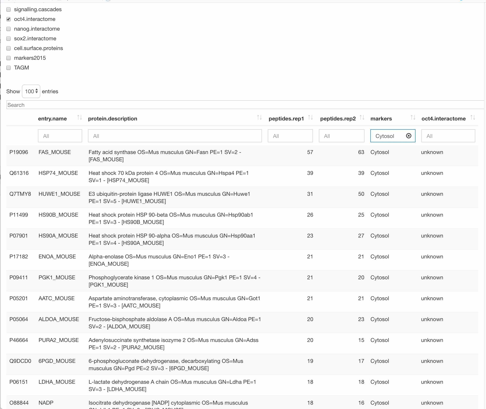

To select/unselect a protein of interest one can simply
click/unclick on the corresponding entry in the table or double click
directly on a protein of interest on the interactive PCA plot. If a protein(s)
in the table is clicked and selected the row in the table will turn
grey and the protein(s) will be highlighted on the PCA plot by a dark
grey circle(s), if the 'Show labels' box is checked (the default) in the right sidebar
panel the protein names for the selected protein(s) will also be shown
on the plot. Any selected proteins on the plot or in the table
can be cleared at any time by clicking the 'Clear selection' button in
the right sidebar panel.

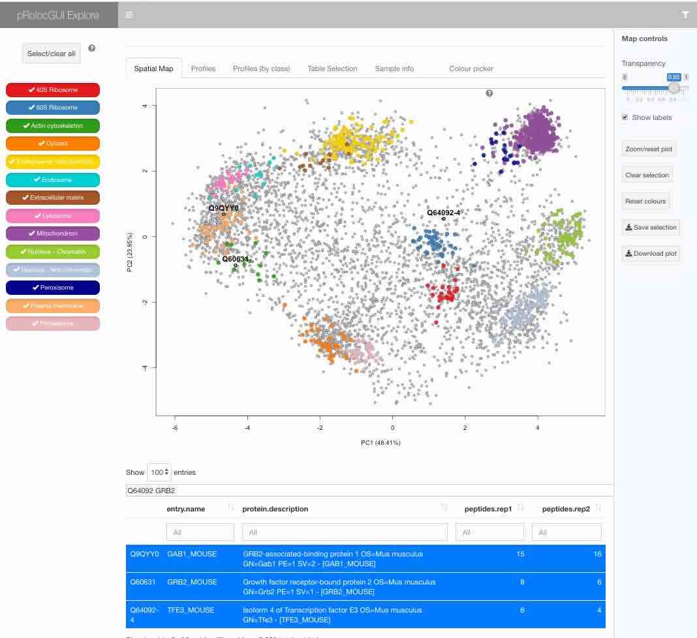
**Saving selected proteins**
Once proteins have been highlighted in the table and/or the plot
they can be exported using the "Save selection" button in the
right sidebar. This will download the ids (as defined by `featureNames`
in the `MSnSet` object) of the current protein selection to a .csv file.

**Zooming** If a user wishes to examine a protein(s) in more detail,
one can zoom in on specific points by hovering the mouse over the plot, 
then clicking and drawing a (square) brush and then clicking the 
'Zoom/reset button' in the right sidebar to zoom to the brushed area. 
This process can be repeated until the desired level of zoom is reached. 
The plot can be resetted to the original size by clicking the 
'Zoom/reset button' once again.

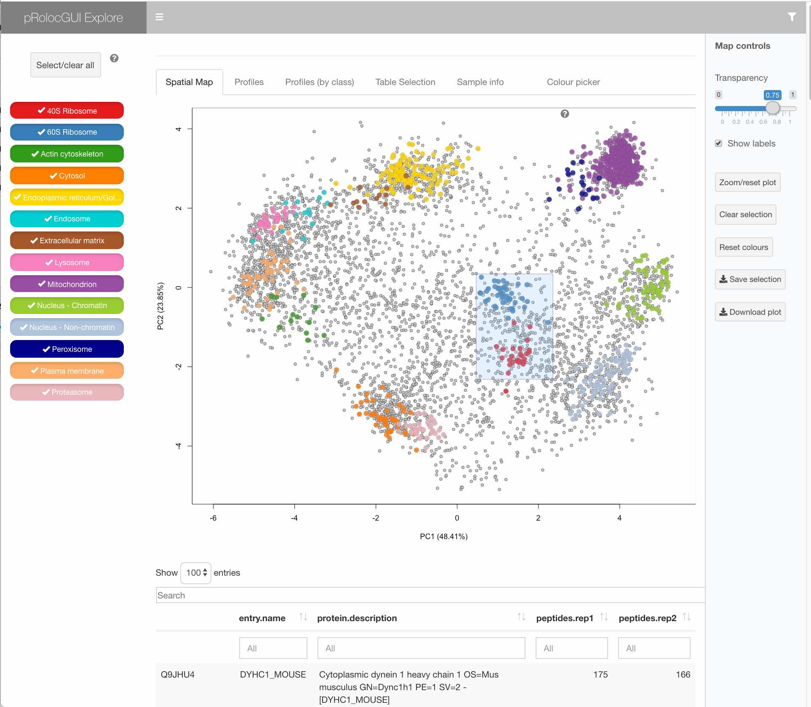
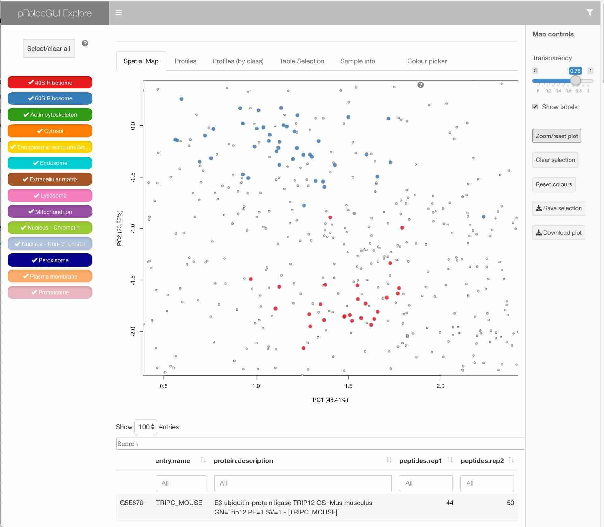

**Downloading figures**
All visualisations in the app (the map and two profile plots) 
can be downloaded as high resolution PDFs by clicking the
"Download Plot" button in the right sidebar panel. 

**Hiding the sidebar panels**
The left and right sidebar panels can be shown/hidden at
any time by clicking the icons in the main dashboard.

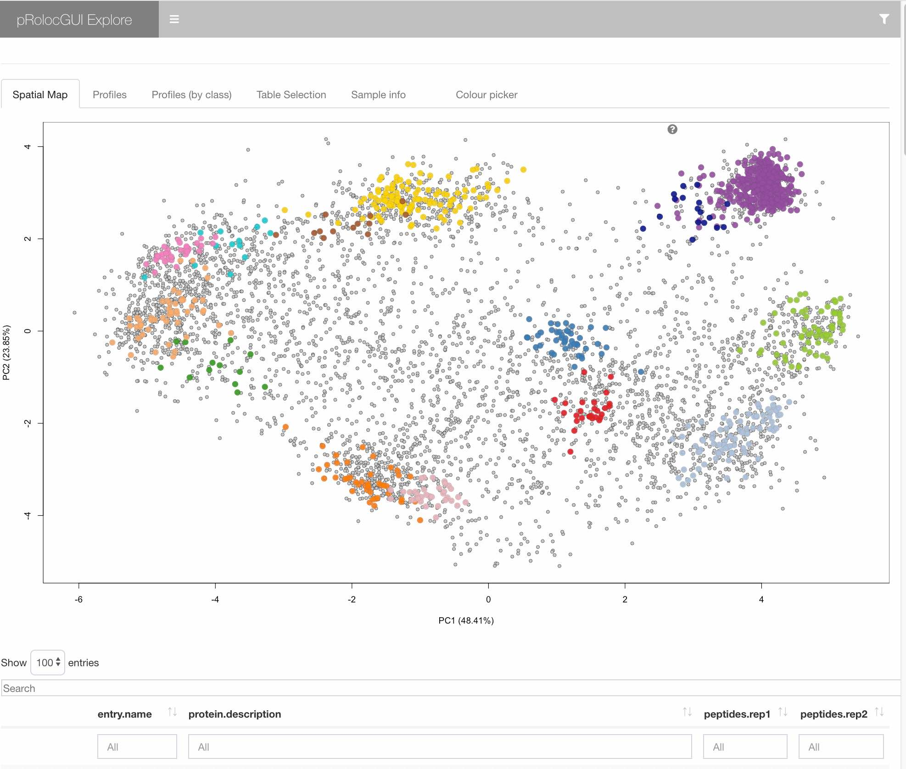


**The profiles tabs** 
There are two profiles tabs in `pRolocGUI` which display the
protein profile quantitation data that is stored in the `exprs` data slot 
of the `MSnSet`. For the `hyperLOPIT2015` dataset this is the relative 
abundances of each protein across the 20 fractions (2 x 10-plex replicates). 

The first "Profiles" tab shows two ribbons plots, one for each dataset. 
As per the Spatial Map tab, the plot is updated according 
to the input classes selected in the sidebar panel on the left. 
A ribbon is plotted for each each sub-cellular class between the 5th and 
95th percentile value per channel. The mean class profile is also highlighted
by a bold line. Unknown/unlabelled profiles are shown as dark gray lines.

The profiles tab is useful to look for discrimination between  
different sub-cellular niches in an easy and direct manor 
where all proteins belonging to the same sub-cellular niche/data 
cluster (as specified by `fcol` when the app is launched) are
loaded together. The protein distribution patterns can then be
examined on a group by group basis. Proteins of interest can be
searched in the data table and once clicked, the distribution(s) 
of selected protein(s) are shown by dotted black lines. 

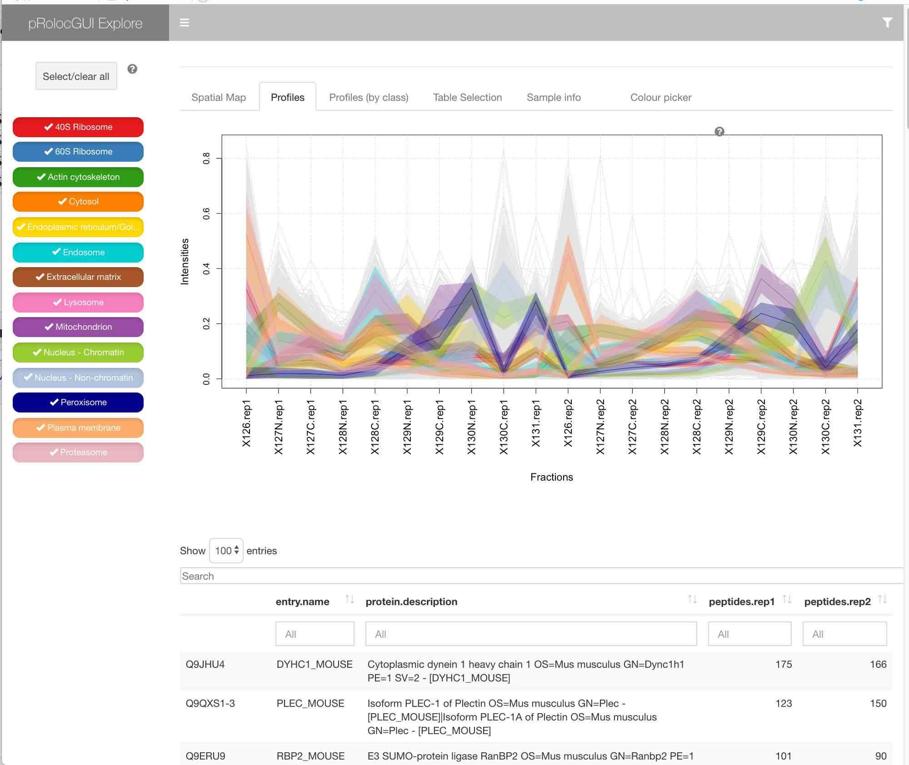
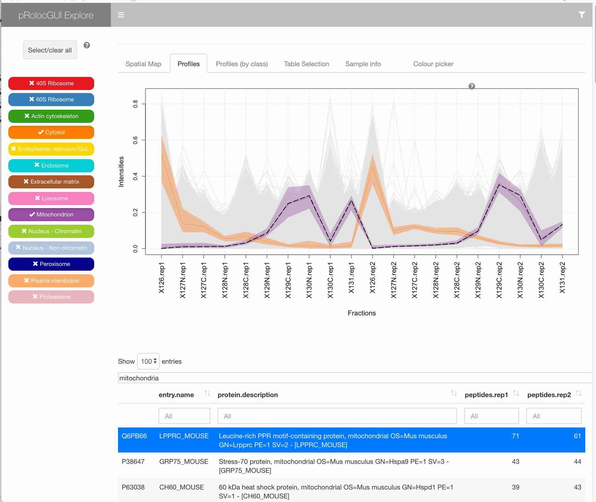
There is a second profiles tab called "Profiles (by class)" which
shows the protein profiles faceted by their class labels. This static 
plot can be useful when comparing the trend between classes, 
especially when two or more classes have very similar trends.


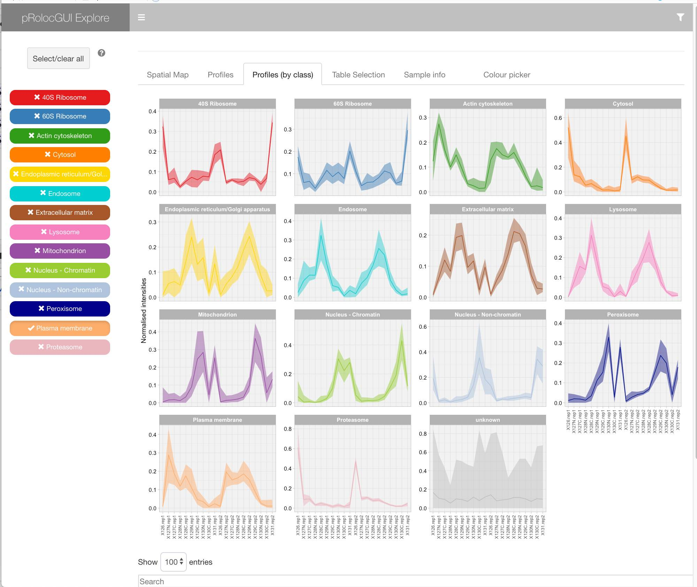

**Table Selection** The Table Selection tab provides an interface 
for data table column selection. Multiple columns can be selected on and 
off by clicking/unclicking the checkboxes that correspond to the columns
in the data table. 

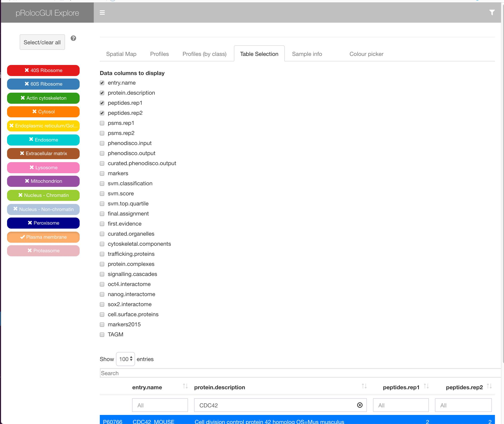

**Sample Information**
The tab "Sample Info" stores any sample information that is stored in 
the `pData` slot of the `MSnSet`.

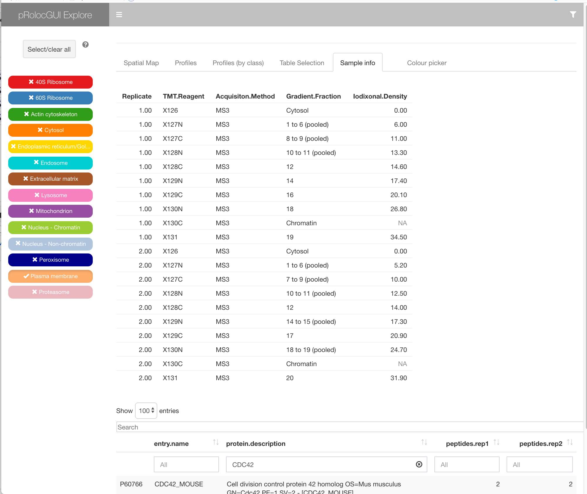

**Colour Picker**
This tab provides an interface to select and set colours for the 
class labels.

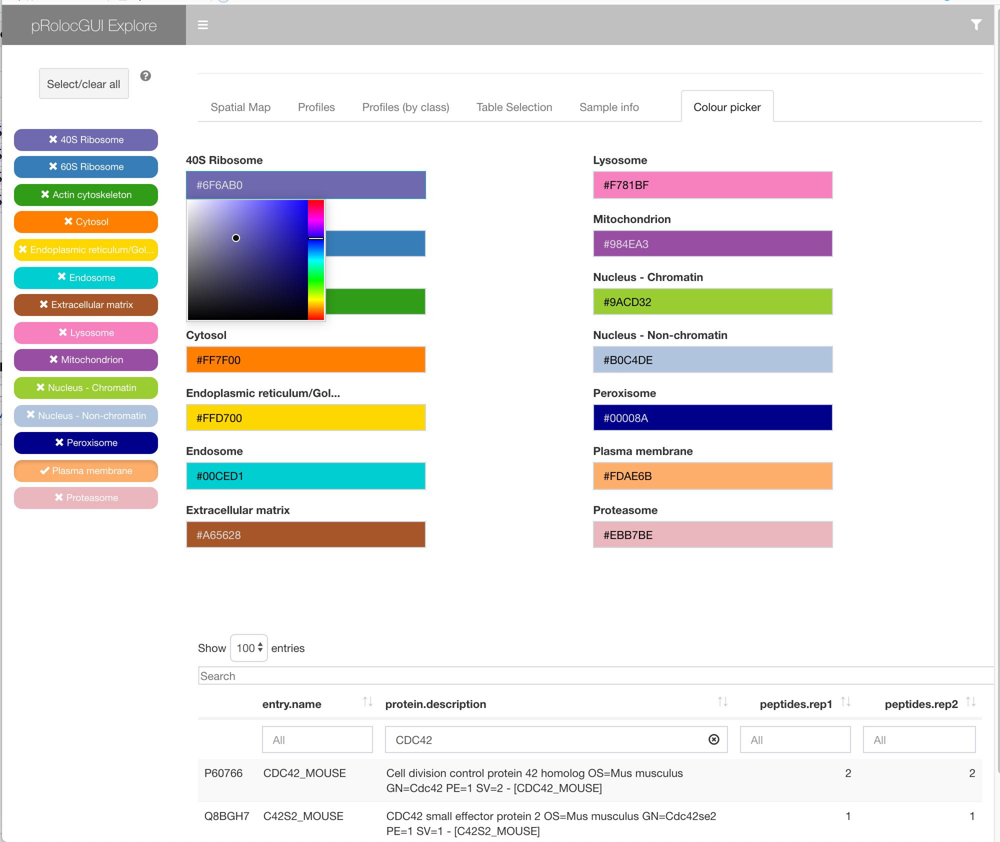

# The `compare` application

The comparison application may be of interest if a user wishes to 
examine two replicate experiments, or two experiments from different
conditions etc.  Two Spatial Map plots are loaded side-by-side 
(the default method is PCA) and one can
search and identify common proteins between the two data sets.

A `MSnSetList` of length 2 must be supplied as input, containing
the two datasets one wishes to compare. In the example below
we load two replicate datasets of mouse embryonic stem cells 
produced using the hyperLOPIT technology.

```{r compare, eval = FALSE, echo = TRUE} 
data(hyperLOPIT2015ms3r1)
data(hyperLOPIT2015ms3r2) 
mydata <- MSnSetList(list(hyperLOPIT2015ms3r1, hyperLOPIT2015ms3r2))
pRolocVis(mydata, app = "compare") 
```

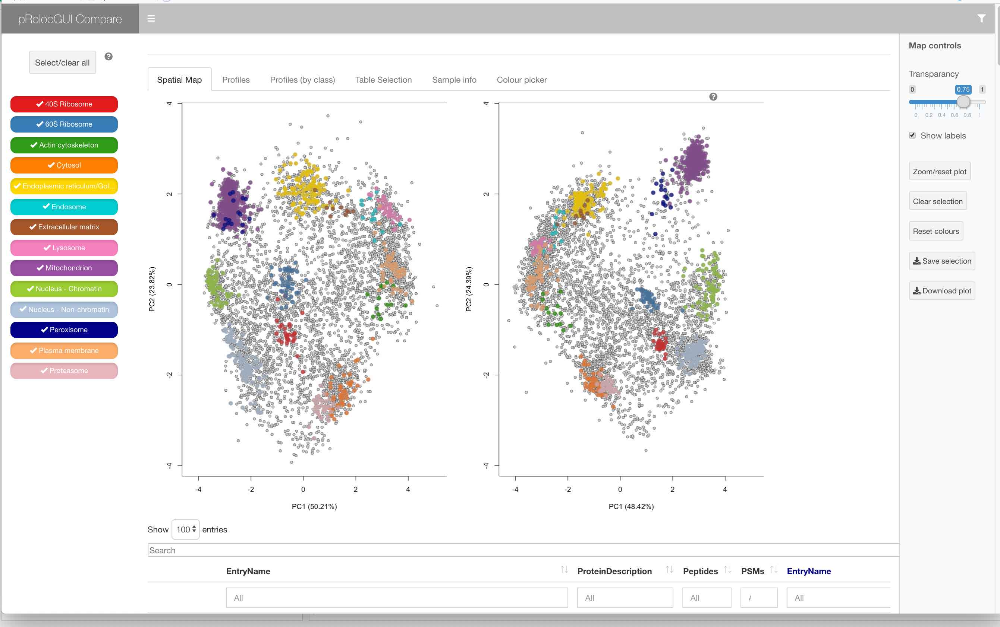

The compare app has the same functionality as the explore application
for protein profile visualisation,interactive searchable datatable that
allows both batch import and export, colour selection and options
to download the visualisations. Visualisations and tables that 
appear in each tab are loaded side-by-side, one per dataset.

# The `aggregate` application

The aggregate app allows users to look both the peptide (and/or PSM)
and/or protein level data together and explore the effects of
PSM/protein aggregation to protein and identify protein groups
with interesting expression patterns. 

To run the `aggregate` app we first load a PSM level dataset from
`pRolocdata`. The dataset `hyperLOPIT2015ms2psm` contains PSM 
level intensity data, where each row corresponds to one PSM 
and each column is the TMT-plex. Please see `?hyperLOPIT2015ms2psm` 
for more information.

We can launch the `pRolocVis` function and look at the PSM data
without aggregating to peptide

```{r aggvar, eval = FALSE, echo = TRUE, message = FALSE, warning = FALSE}
## load PSM data
data("hyperLOPIT2015ms2psm")

## Visualise the PSMs per to protein group
pRolocVis(hyperLOPIT2015ms2psm, app = "aggregate", fcol = "markers",
          groupBy = "Protein.Group.Accessions")
```

Or we can first aggregate from PSM to peptide and then launch the
app to look at the relationships between peptide level data and 
protein groups. For this latter case we can use the `combineFeatures`
function from `MSnbase`. 

```{r aggvar2, eval = FALSE, echo = TRUE, message = FALSE, warning = FALSE}
## Combine PSM data to peptides
hl <- combineFeatures(hyperLOPIT2015ms2psm,
                      groupBy = fData(hyperLOPIT2015ms2psm)$Sequence,
                      method = median)

## Visualise peptides according to protein group
pRolocVis(hyperLOPIT2015ms2psm, app = "aggregate", fcol = "markers",
          groupBy = "Protein.Group.Accessions")
```

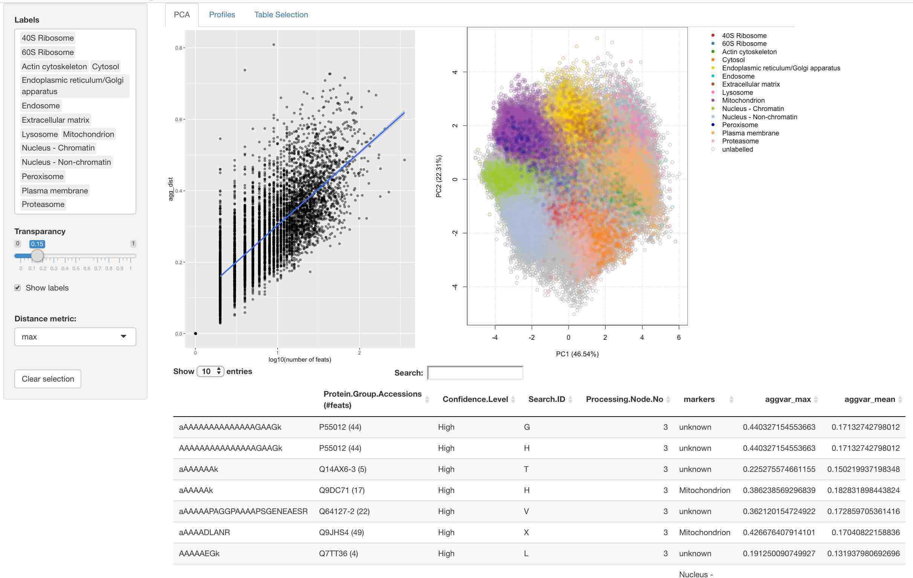

The main body of the app contains (1) a `aggvar` distance plot and a 
(2) PCA plot of the PSMs/peptides. The `aggvar` distance plot shows the 
(log10) number of features (in this example peptides) per protein group
and the aggregation summarising distance per protein group. 
The app uses the function `aggvar` from 
`r Biocpkg("MSnbase")` package. 

As described in the `?aggvar` 
documentation, the app, can take `max` or `mean` as a function, 
and this can be selected in the left sidebar panel. By default,
on loading the max is calculated. Using max as a function, 
one can help identify protein groups with single extreme outliers, 
such as, for example, a mis-identified peptide that was erroneously 
assigned to that protein group. The mean can also be used as a function
to identify more systematic inconsistencies where, for example, 
the subsets of peptide (or PSM) feautres correspond to proteins 
with different expression patterns.


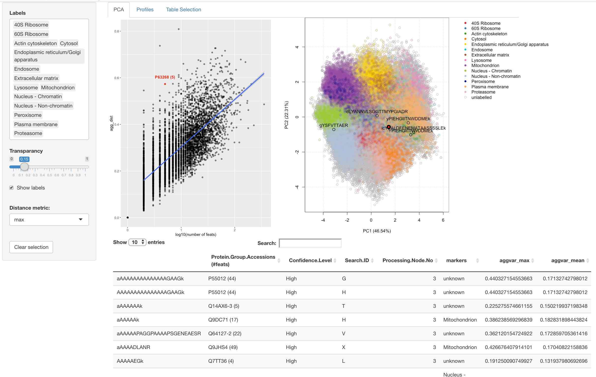

Both the aggvar plot and PCA plot are interactive, 
and similarly to the other `pRolocVis` apps you can click 
individual proteins or peptides in either the aggvar
or PCA plot, to search and highlight peptides and 
proteins of interest. When a protein group is clicked 
in the left plot, the peptides and associated protein 
group are automatically shown on the right PCA plot.

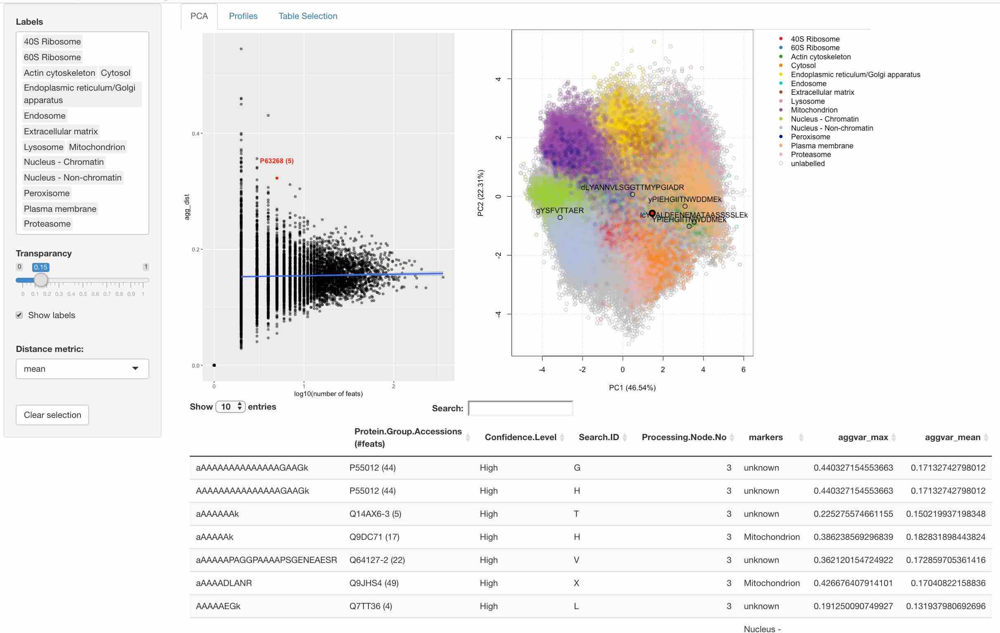
As previously mentioned `aggvar` can use either max or mean as
a function. In the left sidebar there is a drop down menu for
users to try each method.

# References

Gatto L., Vizcaíno J.A., Hermjakob H., Huber W. and Lilley K.S.
*Organelle proteomics experimental designs and analysis* [Proteomics,
10:22, 3957-3969, 2010](http://www.ncbi.nlm.nih.gov/pubmed/21080489).

Gatto L., Breckels L.M., Burger T., Nightingale D., Groen A.J.,
Campbell C., Nikolovski N., Mulvey C.M., Christoforou A., Ferro M.,
Lilley K.S. *A foundation for reliable spatial proteomics data
analysis*,
[Mol Cell Proteomics. 2014 Aug;13(8):1937-52](http://www.ncbi.nlm.nih.gov/pmc/articles/PMC4125728/).

Christoforou A., Mulvey C.M., Breckels L.M., Hayward P.C., Geladaki
E., Hurrell T., et al. *A draft map of the mouse pluripotent stem cell
spatial
proteome*. [Nat Commun. 2016 Jan 12;7:9992](http://www.nature.com/ncomms/2016/160112/ncomms9992/full/ncomms9992.html).

