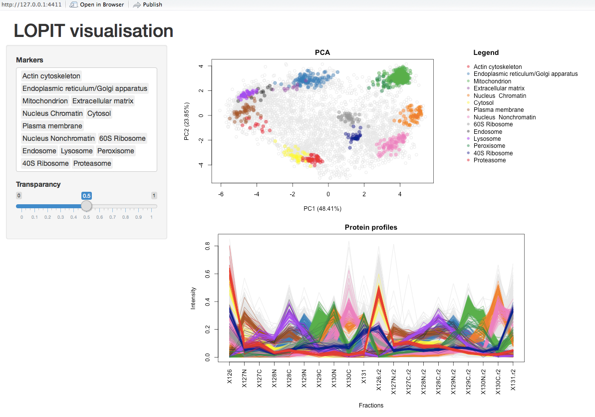
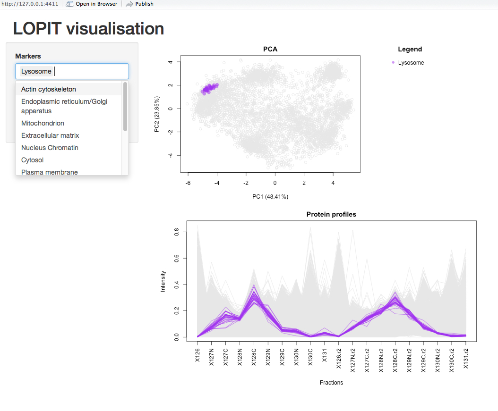

```{r, env, eval=TRUE, echo=FALSE, warning=FALSE, message=FALSE}
library(knitcitations)
cite_options(hyperlink = FALSE, style = "markdown")
library(bibtex)
extbib <- read.bib("pRolocGUI.bib")
```

# Foreword

`pRolocGUI` is under active development; current functionality is
evolving and new features will be added. This software is free and
open-source. You are invited to contact Laurent Gatto (lg390@cam.ac.uk) or
Lisa Breckels (lms79@cam.ac.uk) in case you have any questions, 
suggestions or have found any bugs or typos. To reach a broader audience
for more general questions about proteomics analyses using R consider 
of writing to the Bioconductor list.

For background on spatial proteomics ...

Questions, feedback, feature/app requests.

# Introduction

This vignette describes the implemented functionality of the
`pRolocGUI` package. The package is based on the `MSnSet` class
definitions of `r Biocpkg("MSnbase")`
and on the functions defined in the package `r Biocpkg("pRoloc")`.
`pRolocGUI` is intended for, but not limited to, the visualisation and 
analysis of quantitative spatial proteomics data. To achieve reactivity 
and interactivity, `pRolocGUI` relies on the 
[`shiny`](http://www.rstudio.com/shiny/) framework.  

This tutorial illustrates the usage of the `pRolocGUI` R package for the
interactive visualisation of spatial proteomics data. 
We recommend some familiarity with the `MSnSet` class (see `?MSnSet`
for details) and the `pRoloc` vignette (available with 
`vignette("pRoloc-tutorial")`) before using `pRolocGUI`.

There are 4 applications distributed with `pRolocGUI` which are 
wrapped and launched by the `pRolocVis` function. These 4 applications 
are called according to the argument `what` in the `pRolocVis` function
which may be one of "pca", "profiles", "classify" and "compare". 

* The `pca` 
application launches a Principal Components Analysis (PCA) plot of the 
data and features a searchable data table to allow highlighting of 
specific proteins.
* The `profiles` application allows visualisation
of protein profiles according to sub-cellular location which is particularly
useful for discriminating between data clusters.
* The `classify` application has been 
designed to view machine learning classification results according to user-specified
thresholds for sub-cellular localisation predictions.
* The `compare` application, 
allows the comparison of two comparable `MSnSet` instances, e.g. this might be of 
great help for analyses of changes in protein localisation in different 
conditions, or two different replicate experiments etc.

To begin, once R is started, the first step to enable functionality 
of the package is to load it. We also load the data package 
`r Biocpkg("pRolocdata")` using the library function, which contains quantitative
proteomics datasets, as shown in the code chunk below:

```{r loadPkgs, echo = FALSE, message = FALSE, warning = FALSE}
library("pRolocGUI")
library("pRolocdata")
```

The `pRolocVis` function requires a minimum of two key arguments
to load an application, these are `object` and `what`. The argument `object`
must be of class `MSnSet` (or a list of `MSnSet` objects of length 2 for 
the `compare` application). The argument `what` tells the `pRolocVis` function
exactly what type of application to load. One can choose from: `"pca"`, 
`"profiles"`, `"classify"`, `"compare"`.

The default application is PCA (`what = "pca"`). The argument `fcol` is the
the feature meta-data label (`fData` column name) to be plotted. This will  
correspond to the prediction column if using `classify` application, or the markers 
(labelled data) otherwise (if no `fcol` is specified `markers` is used as default,
with the excpetion of classify where one should specify `fcol` as the feature data
column containing their classification results). 

We begin by loading an example dataset from the `pRolocdata` data package.

```{r loadData, echo = TRUE, message = FALSE, warning = FALSE}
data(hyperLOPIT2015)
```

The dataset `hyperLOPIT2015` is data from using the hyperLOPIT technology on 
mouse E14TG2a embryonic stem cells.

`pRolocVis` needs an object of class `MSnSet` as an argument. We can launch the
application with a `MSnSet` by assigning it to the argument `object`, and 
specifying the type of application to load using the argument `what`. For 
example, to load the pca application or profiles application:
```{r example, eval = FALSE, echo = TRUE}
pRolocVis(object = hyperLOPIT2015, what = "pca")
pRolocVis(object = hyperLOPIT2015, what = "profiles")
```

Launching any of the `pRolocVis` applications will open a new tab in a separate
pop-up window, and one can then open the application in your default Internet 
browser if desired, by clicking the 'open in browser' button in the top panel 
of the window.

To stop the applications from running press `Esc` or `Ctrl-C` in the
console (or use the "STOP" button when using RStudio) and close the
browser tab, where `pRolocVis` is running.

## Which app should I use?
There are 4 different applications, each one designed to address a different
specific user requirement.

* The PCA app is intended for displaying and searching your data, which 
features a clickable interface and zoomable PCA plot. If you would like to
search for a particular protein, set of protein or protein feature this is the
application to use.
* The profiles app is designed for examining the patterns of particular
sets of proteins. For example, if one has several overlapping sub-cellular
clusters in their data, as highlighted by PCA or otherwise, one can check
for separation in all data dimensions by examining the protein profile
patterns. Proteins characteristic of particular compartment have distinctive
protein profile distributions.
* The classification app can be used for viewing the sub-cellular class 
predictions output from a supervised machine learning analysis 
and to help set a classification threshold (see the 
[pRoloc tutorial](http://bioconductor.org/packages/release/bioc/vignettes/pRoloc/inst/doc/pRoloc-tutorial.pdf) for details on spatial proteomics data analysis).
* The comparison application may be of interest if a user wishes to examine
two replicate experiments, or two experiments from different conditions etc. 
Two PCA plots are loaded side-by-side and one can search and identify common
proteins between the two data sets.

# The `pca` application

To run the `pca` application using `pRolocVis`:
```{r pca1, eval = FALSE, echo = TRUE}
pRolocVis(object = hyperLOPIT2015, what = "pca")
```

The `pca` application is subdivided in to two tabs: (1) PCA, and (2) profiles.
A searchable data table containing the experimental feature meta-data is 
permanantly dispalyed at the bottom of the screen for ease. You browse between 
the two tabs by simply clicking on them. 


The PCA tab is characterised by its main panel which shows a
PCA plot for the selected `MSnSet`. By default a PCA plot is used to
display the data and the first two principal components are plotted.
Given a multivariate dataset, PCA transforms the original high dimensional 
data into a smaller lower-dimensional set of uncorrelated variables (principal
components) such that the first principal component has the largest possible 
variance to account for as much variability in the data as possible and each 
succeeding component in turn has the highest variance possible under the 
constraint that it be orthogonal to the preceding components. Other ordinance
methods are available for displaying the data and can be specified using
the `method` argument, for example, multidimensional scaling (MDS), and kernal-PCA,
among other are available and are listed in `plot2Dmethods` in `pRoloc`. 
A matrix can also be passed to `method` where the rownames must match object's 
feature names and represent a projection of the data in \code{object} in two 
dimensions.

The sidebar panel controls what features
to highlight on the PCA plot; input can be selected by clicking on and off
the data classe names, or by typing and searching in the white input box. 
Selected items can then be deleted and the PCA plot will be updated accordingly.
Below the select box is a transparancy slider bar which controls the opacity of  
the highlighted data classes. At the bottom of the sidebar panel there 
is a checkbox which when checked shows the protein names of any selected 
proteins on the PCA plot. 

Below the PCA plot is a searchable data table containing the fetaure meta
data (`fData`). For LOPIT experiments, such as the one used in this example,
this may contain protein accession numbers, protein entry names, protein
description, the number of quantified peptides per protein, and also other 
columns containing sub-cellular localisation information. One can search for proteins
of interest by typing informationin the white search box, above the table to the right. Searching is done by partial pattern matching with table elements. Any matches
or partial text matches are highlighted in yellow. To select/unselect a protein of 
interest one can simply click/unclick on the corresponding row in the table and the
protein will be highlighted/removed on/from the PCA plot (the protein name will be
displayed if the checkbox 'labels' is ticked.)


A user can switch between the PCA and profiles tab by clicking the tab at the
top of the page. All protein profiles are shown in grey. For LOPIT experiments
these protein profiles show the relative abundance of each protein across 
the fractions employed. Proteins that co-localise are expected to have 
similar profiles based on De Duve's principle.


Can also use the  import/export functionality by using 
the `FeaturesOfInterest`/`FoICollection` infrastructure distributed by 
the `MSnbase` package.

# The `profiles` application

Plotting the first two principal components of the data usually gives one a good  
general overview of the quality/separartion of the sub-cellular niches in their
data, but it also limits us to viewing a N-dimensional dataset in 2-dimensions, 
and one can potenitally miss niches of interest. To examine the quality of 
sub-cellular clusters one is better to look at the profiles of the residents
in these clusers, to see if they share the same pattern. To do this, one can 
use the `profiles` application.

To launch the `profiles` application;
```{r profiles1, eval = FALSE, echo = TRUE}
pRolocVis(object = hyperLOPIT2015, what = "profiles")
```

The `profiles` application is characterised by two plots: a small PCA plot and
a profiles plot. Both are updated according to the input selected in the
sidebar panel on the left. This menu works the same as the select menu for the
`pca` application, as detailed above. Also, as per the `pca` application, 
automatically, all sub-cellular classes that appear in the selected `fcol` 
are highlighted (if `fcol` is not specified, as in the above example, the 
default is `fcol = "markers"`).  



Classes can be deleted by clicking on them re-added by selecting them from the
drop down menu which appears when you click in the white select box.



--> Compare two overlapping clusters, discriminate between clusters use profiles app

# The `classify` application

```{r classify, eval = FALSE, echo = TRUE}
opt <- svmOptimisation(object = hyperLOPIT2015, fcol = "markers", 
                       times = 3, xval = 5)
res <- svmClassification(object = hyperLOPIT2015, assessRes = opt)
pRolocVis(object = res, what = "classify", fcol = "svm")
```

# The `compare` application

```{r compare, eval = FALSE, echo = TRUE}
data(hyperLOPIT2015ms3r1)
data(hyperLOPIT2015ms3r2)
pRolocVis(list(hyperLOPIT2015ms3r1, hyperLOPIT2015ms3r2), what = "compare")
```


