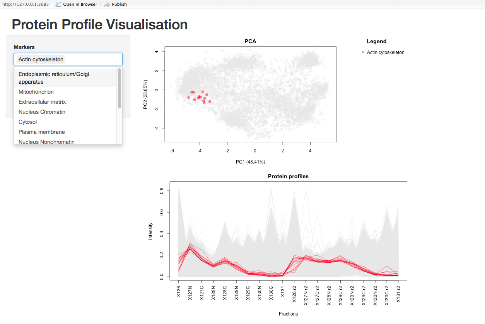

--- 
title: "pRolocGUI: Interactive visualisation of spatial proteomics data" 
author: "Lisa Breckels, Thomas Naake and Laurent Gatto" 
output:
BiocStyle::html_document vignette: >
  %\VignetteIndexEntry{pRolocGUI: Interactive visualisation of spatial 
                       proteomics data} 
  %\VignetteEngine{knitr::rmarkdown}
  %\VignetteEncoding{UTF-8}  
---


```{r, env, eval=TRUE, echo=FALSE, warning=FALSE, message=FALSE}
library(knitcitations) 
library(BiocStyle)
cite_options(hyperlink = FALSE, style = "markdown") 
```

# Foreword

`pRolocGUI` is under active development; current functionality is
evolving and new features will be added. This software is free and
open-source. You are invited to contact Laurent Gatto
(lg390@cam.ac.uk) or Lisa Breckels (lms79@cam.ac.uk) in case you have
any questions, suggestions or have found any bugs or typos. To reach a
broader audience for more general questions about proteomics analyses
using R consider of writing to the Bioconductor list.

For background on spatial proteomics ...

Questions, feedback, feature/app requests.

# Introduction

This vignette describes the implemented functionality of the
`pRolocGUI` package. The package is based on the `MSnSet` class
definitions of `r Biocpkg("MSnbase")` and on the functions defined in
the `r Biocpkg("pRoloc")` package. `r Biocpkg("pRolocGUI")` is
intended for, but not limited to, the interactive visualisation and
analysis of quantitative spatial proteomics data. To achieve
reactivity and interactivity, `pRolocGUI` relies on the
[`shiny`](http://www.rstudio.com/shiny/) framework. We recommend some
familiarity with the `MSnSet` class (see `?MSnSet` for details) and
the `pRoloc` vignette (see `vignette("pRoloc-tutorial")`) before using
`pRolocGUI`.

There are 4 applications distributed with `pRolocGUI` which are
wrapped and launched by the `pRolocVis` function. These 4 applications
are called according to the argument `what` in the `pRolocVis`
function which may be one of "pca", "profiles", "classify" or
"compare". 

* The `pca` application launches a Principal Components Analysis (PCA) 
plot of the data and features a searchable data table for the
identification of proteins of interest.
* The `profiles` application allows visualisation of protein profiles 
patterns according to sub-cellular location.
* The `classify` application has been designed to view machine 
learning classification results according to user-specified thresholds
for the assignment of sub-cellular location.
* The `compare` application allows the comparison of two comparable 
`MSnSet` instances, e.g. this might be of help for the analyses of
changes in protein localisation in different conditions.

## Getting started

Once R is started, the first step to enable functionality of the
package is to load it, as shown in the code chunk below.  We also load
the `r Biocpkg("pRolocdata")` data package, which contains
quantitative proteomics datasets.

```{r loadPkgs, message = FALSE, warning = FALSE} 
library("pRolocGUI")
library("pRolocdata") 
```

We begin by loading the dataset `hyperLOPIT2015` from the `pRolocdata`
data package. The data was produced from using the hyperLOPIT
technology on mouse E14TG2a embryonic stem cells [^1].

```{r loadData, echo = TRUE, message = FALSE, warning = FALSE}
data(hyperLOPIT2015) 
```

To load one of the applications using the `pRolocVis` function and
view the data you are required to specify a minimum of two key
arguments, these are `object` and `what`. The argument `object` is the
data and must be of class `MSnSet` (or a list of `MSnSet` objects of
length 2 for the `compare` application). Please see
`vignette("pRoloc-tutorial")` or `vignette("MSnbase-io")` for
importing and loading data. The argument `what` tells the `pRolocVis`
function exactly what type of application to load. One can choose
from: `"pca"`, `"profiles"`, `"classify"`, `"compare"`. The default
application is PCA (`what = "pca"`).  The optional argument `fcol` can
be used which is used to specify the feature meta-data label (`fData`
column name) to be plotted. The default is `markers` (i.e. the
labelled data) for all applications except the classification app. For
the classification app one must specify the prediction column i.e. the
feature meta-data label that correspinds to the column containing the
classification results, resultant from running a supervised machine
learning analysis (see [below](#the-classify-application)).

For example, to load the pca application or profiles application:

```{r example, eval = FALSE, echo = TRUE} 
pRolocVis(object = hyperLOPIT2015, what = "pca", fcol = "markers") 
pRolocVis(object = hyperLOPIT2015, what = "profiles", fcol = "markers") 
```

Launching any of the `pRolocVis` applications will open a new tab in a
separate pop-up window, and one can then open the application in your
default Internet browser if desired, by clicking the 'open in browser'
button in the top panel of the window.

To stop the applications from running press `Esc` or `Ctrl-C` in the
console (or use the "STOP" button when using RStudio) and close the
browser tab, where `pRolocVis` is running.

## Which app should I use?  

There are 4 different applications, each one designed to address a 
different specific user requirement.

* The PCA app is intended for displaying and searching your data,
which features a clickable interface and zoomable PCA plot. If you would
like to search for a particular protein or set of proteins this is the
application to use.
* The profiles app is designed for examining the patterns of user-specified
sets of proteins. For example, if one has several overlapping
sub-cellular clusters in their data, as highlighted by PCA or
otherwise, one can check for separation in all data dimensions by
examining the protein profile patterns. Proteins that co-localise are
known to exhibit similar distributions (De Duve's principale).
* The classification app can be used for viewing the sub-cellular class 
predictions output from a supervised machine learning analysis and to
help the user set a classification threshold (see the `pRoloc`
tutorial](http://bioconductor.org/packages/release/bioc/vignettes/pRoloc/inst/doc/pRoloc-tutorial.pdf)
for details on spatial proteomics data analysis).
* The comparison application may be of interest if a user wishes to 
examine two replicate experiments, or two experiments from different
conditions etc.  Two PCA plots are loaded side-by-side and one can
search and identify common proteins between the two data sets.

# The `pca` application

The `pca` application is characterised by an interactive and
searchable Principal Components Analysis (PCA) plot. PCA is an
ordinance method that can be used to transform a high-dimensional
dataset into a smaller lower-dimenensional set of uncorrelated
variables (principal components), such that the first principal
component has the largest possible variance to account for as much
variability in the data as possible. Each succeeding component in turn
has the highest variance possible under the constraint that it be
orthogonal to the preceding components. Thus, PCA is particularly
useful for visualisation of multidimensional data in 2-dimensions,
wherein all the proteins can be plotted on the same figure.

The application is subdivided in to two tabs: (1) PCA, and (2)
profiles.  A searchable data table containing the experimental feature
meta-data is permanantly dispalyed at the bottom of the screen for
ease. You can browse between the two tabs by simply clicking on them
at the top of the screen.

To run the `pca` application using `pRolocVis`: 

```{r pca1, eval = FALSE, echo = TRUE} 
pRolocVis(object = hyperLOPIT2015, what = "pca", fcol = "markers") 
```


**Viewing** The PCA tab is characterised by its main panel which shows
a PCA plot for the selected `MSnSet`. By default a PCA plot is used to
display the data and the first two principal components are plotted.
The sidebar panel controls what features to highlight on the PCA plot.
Under the 'Labels' tab, input can be selected by clicking on and off
the data class names, or by typing and  searching in the white input
box. Selected items can then be deleted, by clicking and pressing the
delete button on your keyboard, and the PCA plot will  be updated
accordingly. Below the select box is a 'transparancy' slider bar which
controls the opacity of the highlighted data classes.


**Searching** Below the PCA plot is a searchable data table containing
the fetaure meta data (`fData`). For LOPIT experiments, such as the
one used in this example, this may contain protein accession numbers,
protein entry names, protein description, the number of quantified
peptides per protein, and columns containing sub-cellular localisation
information. The data table is limited to displaying 12 columns of
information, these are automatically selected from the `fData` to be
the first 6 and last features. To select specific columns in the 
`fData` to display in the data table use the `fdataInds` argument.
One can search for proteins of interest by using the
white search box, above the table to the right. Searching is done by
partial pattern matching with table elements.  Any matches or partial
text matches that are found are highlighted in yellow in the data
table. To select/unselect a protein of interest one can simply
click/unclick on the corresponding entry in the table. If a protein(s)
in the table is clicked and selected the row in the table will turn
grey and the protein(s) will be highlighted on the PCA plot by dark
grey circles, if the 'Show labels' box is checked in the left sidebar
panel the protein names for the selected protein(s) will also be shown
on the PCA plot.


**Zooming** If a user wishes to examine a protein(s) in more detail,
one can zoom in on specific points hovering the mouse over the plot
and drawing a brush and then double-clicking on the brush. This
process can be repeated until the desired level of zoom is reached.
The plot is resetted to the original size by a double click anywhere
on the white space of plot.


**Profiles** A user can switch between the PCA and profiles tab by
clicking the tab at the top of the page. All protein profiles are
shown in grey. The distribution(s) of selected protein(s) are shown by
black lines. For LOPIT experiments these protein profiles show the
relative abundance of each protein across the fractions employed in
the experiment. Proteins that co-localise are expected to have similar
profiles based on De Duve's principle. 


**Features** There is also functionality to use the
`FeaturesOfInterest`/`FoICollection` infrastructure distributed by the
`MSnbase` package (for examples on how to create `FeaturesOfInterest`
see the [`pRoloc`
tutorial](http://bioconductor.org/packages/release/bioc/vignettes/pRoloc/inst/doc/pRoloc-tutorial.pdf))`.

**Note:** Other ordinance methods are available for displaying
the data, for example, multidimensional scaling (MDS), and kernal-PCA,
and t-SNE are all supported, and can be specified using the `method`
argument when caling `pRolocVis`.

# The `profiles` application

The `profiles` application is designed for examining the protein
profile patterns of proteins that reside in the same sub-cellular
niches, complex or data cluster. It may be particularly useful to help
discriminate between overlapping data clusters (ad visualised using
the `pca` app). 

To launch the `profiles` application; 

```{r profiles1, eval = FALSE, echo = TRUE} 
pRolocVis(object = hyperLOPIT2015, what = "profiles", fcol = "markers") 
```



The `profiles` application is characterised by two plots: a small PCA
plot and a protein profiles plot which shows the quantitation data
that is stored in the `exprs` data slot of the `MSnSet`. For the
`hyperLOPIT2015` dataset this is the relative abundances of each
protein across the 20 fractions (2 x 10-plex replicates). Both the PCA
and profiles plots are updated according to the input selected in the
sidebar panel on the left. This menu works the same as the select menu
in the `pca` application, where data classes can be added/deleted by 
clicking on them in the drop down menu which appears when you click 
in the white select box.

Although both of the `pca` and `profiles` applications contain both a
PCA plot and a protein profiles plots they have been designed for
different use cases.  The `profiles` application has been deisgned to
specifically look for discrimination between (potentially
overlappling) sub-cellular niches. The `profiles` app allows one to do
this in an easy and direct manor where all proteins belonging to the
same sub-cellular niche/data cluster (as specified by `fcol`) are
loaded together. The protein distribution patterns can then be
examined on a group vs group basis. This is not possible with the
`pca` application. The `pca` application has been deisgned for getting
a clear overview of the data structure including the data clusters and
hence the sub-cellular niches of interest, but most importantly, for
querying the data and highlighting proteins of interest. Although one
is also able to view protein distributions with this application, one
can not load groups of proteins for visualisation of their
distribution patterns, as per the `profiles` app. 

# The `classify` application

Machine learning classification forms a large part of spatial
proteomics data analysis. Protein localisation prediction can be cast
as a supervised machine learning problem (learning from labelled instances), wherein one has a set of a
few well-known examples (labelled data), that is sub-cellular protein
markers (proteins that are known to belong to a set of finite sub-cellular
niches), which can used to learn a classifier to associate unlabelled
proteins to one of the sub-cellular classes that appear in the
labelled training data.

In the example below, we use one of the classification algorithms from the `r Biocpkg("pRoloc")`
package; a Support Vector Machine (SVM) classifier, and train a model for
protein localisation prediction of unassigned proteins in the
`hyperLOPIT2015` dataset. We first use the `svmOptimisation` function
to find the best model parameters using the labelled training data
found in `fcol = "markers"` and then apply these parameters using the
`svmClassification` function. (Note, here we perform a reduced search
using `times = 3` in the interest of time. In practise we recommend at
least to use `times = 100` as described in the [`pRoloc`
tutorial](http://bioconductor.org/packages/release/bioc/vignettes/pRoloc/inst/doc/pRoloc-tutorial.pdf). This tutorial also 
contains more information on machine learning, the practise
of training and testing, and some extensive examples of machine
learning classification in spatial proteomics.)

```{r classify, eval = TRUE, echo = TRUE} 
opt <- svmOptimisation(object = hyperLOPIT2015, 
                       fcol = "markers", 
                       times = 1, verbose = FALSE)
res <- svmClassification(object = hyperLOPIT2015, assessRes = opt) 
```

By default, the classification function adds new feature variables containing the new sub-cellular
assignments made by the SVM classifier and the associated assignment probabilities,
called scores, to the `featureData` slot of
the `MSnSet`, in this case, they are labelled `svm` and `svm.scores`,
and can be accessed using the `fData` accessor method, e.g.
`fData(res)$svm` or `fData(res)$svm.scores`.

It is common when applying a supervised classification algorithm,
wherein the whole class diversity is not present in the training data,
to set a specific score cutoff on which to define new assignments,
below which classifications are set to unknown/unassigned. Deciding on
a threshold is not trivial as classifier scores are heavily dependent
upon the classifier used and different sub-cellular niches can exhibit
different score distributions. To help examine these distributions and
set a threshold one can use the `classify` app. 

To launch the `classify` application:

```{r cutoff, eval = FALSE, echo = TRUE} 
pRolocVis(object = res, what = "classify", fcol = "svm") 
```


The data is loaded and displayed on a PCA plot and a boxplot is used to
display the classifier scores by data class. On the left there is
a sidebar panel with sliders to control the thresholds upon which classifications 
are made. There are two types of cut-off that the user can choose from: (1)
"Quantile" and (2) "User-defined". By default, when the application is launched
quatile scoring is selected and set to 0.5, the median. The 
class-specific score thresholds that correspond to selecting the desired
quantile are shown on as red dots on the boxplot. The assignments on the PCA
plot are also updated according to the selected threshold. The quantile 
threshold can be set by moving the corresponding quantile slider. If one
wished to set their own cut-offs the "User-defined" radio button must be selected
and then the sliders for defining user-specified scores become active and the
scores and highlighted on the boxplot by blue dots. 


By default, when user-specified
scores are selected all sliders are set to 1 and can be changed by moving 
the sliders to the desired score. Once the desired score has been found the
application can be closed and the class-specific scores are displayed in the
R console. These scores can be used to get protein localisation predictions
using the `getPredictions` function, as demonstrated below:

```{r score, eval=FALSE}
mythreshold <- pRolocVis(object = res, what = "classify", fcol = "svm") 
res <- getPredictions(res, fcol = "svm", 
                      mcol = "markers", t = mythreshold)
```

The classification app can also be used as an intercative version of 
the function `orgQuants` in the `r Biocpkg("pRoloc")` package.

# The `compare` application

The comparison application may be of interest if a user wishes to 
examine two replicate experiments, or two experiments from different
conditions etc.  Two PCA plots are loaded side-by-side and one can
search and identify common proteins between the two data sets.

A `list` of `MSnSet`s of length 2 must be supplied as input, these
are the two datasets one wishes to compare. In the example below
we load two replicate datasets of mouse embryonic stem cells 
produced using the hyperLOPIT technology. 

```{r compare, eval = FALSE, echo = TRUE} 
data(hyperLOPIT2015ms3r1)
data(hyperLOPIT2015ms3r2) 
mydata <- list(hyperLOPIT2015ms3r1, hyperLOPIT2015ms3r2)
pRolocVis(mydata, what = "compare") 
```


The compare application is divied in to 7 tabs:  

* PCA,    
* protein profiles,  
* quantitation,  
* feature meta-data,  
* sample meta-data and  
* search,
* data. 

You browse through the tabs by simply clicking on them. To get started
add `fData` information to the plot by selecting a label under the 
"plot colour" drop down menu. We can select "markers" which highlights
the data classes found in the feature meta-data label `markers`. To
select the same annotation for the second dataset one can click the
radio buttons in the left panel to `object2` and then repeat the process.
Both datasets now have the same data classes highlighted. One can examine
where the same proteins lie in each replicate by first clicking `pca` in 
the display selection tabe and then clicking the protein of interste on 
one of the PCA plots, the protein will then be highlighted by a blue border
and the same protein in the other replicate will also be highlighted.
Full details on how to use this application can be found in XXX vignette.


**References**

[^1]: Christoforou A, Mulvey CM, Breckels LM, Hayward PC, Geladaki E, 
Hurrell T, et al. A draft map of the mouse pluripotent stem cell 
spatial proteome. Nat Commun; In Press.

