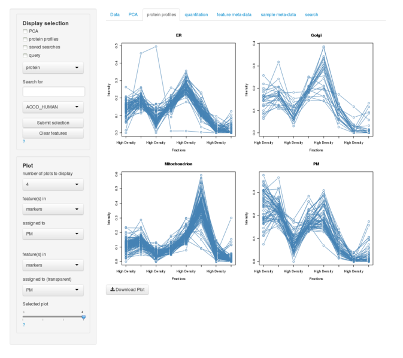

<!--
%\VignetteEngine{knitr::knitr}
%\VignetteIndexEntry{pRolocVis application}
%\VignetteKeywords{Visualisation, Organelle, Spatial, Proteomics, Shiny}
%\VignettePackage{pRolocGUI}
-->


```{r, eval=TRUE, echo=FALSE, warning=FALSE, message=FALSE}
library(knitcitations)
cite_options(linked = FALSE)
extbib <- read.bib("pRolocGUI.bib")
```


<h1>pRolocGUI: Interactive visualisation of organelle (spatial) proteomics data</h1>


#### Thomas Naake and Laurent Gatto*

#### *Computational Proteomics Unit, University of Cambridge

### Foreword

This vignette describes the implemented functionality in the
`pRolocGUI` package. The package is based on the `MSnSet` class
defininitions of `MSnbase` 
[`r citep(extbib["GattoLilley2012"])`](#references)
and on the functions defined in the package `pRoloc` 
[`r citep(list(extbib["Breckels2013"], extbib["Gatto2014"]))`](#references). 
It is especially meant for the analyses of
LOPIT [`r citep(extbib["Dunkley2006"])`](#references)
or PCP [`r citep(extbib["Foster2006"])`](#references) experiments.  
To achieve reactivity
and interactivity, `pRolocGUI` relies on the
[`shiny`](http://www.rstudio.com/shiny/) framework.  The implemented
application facilitates a higher degree of interactivity with the
underlying spatial proteomics data.

We recommend some familiarity with the `MSnSet` class (see `?MSnSet`
for details) and the `pRoloc` vignette (available with
`vignette("pRoloc-tutorial")`).

`pRolocGUI` is under active development; current funtionality is
evolving and new features will be added. This software is free and
open-source. You are invited to contact Thomas Naake (tn299@cam.ac.uk)
in case you have any questions, suggestions or have found any bugs or
typos. To reach a broader audience for more general questions about
proteomics analyses using R consider of writing to the Bioconductor
list.


-------------------
<a id="introduction"></a> 

<h2>1. Introduction</h2>


Currently, `pRolocGUI` distributes the `pRolocVis` application. Launch
it by loading the `pRolocGUI` package and running `pRolocVis()` function:  
```{r, eval = FALSE, echo = TRUE}
library("pRolocGUI")
pRolocVis()
```


This will open a new tab in your default Internet browser. You can
also pass directly an `MSnSet` (e.g. `dunkley2006` available from the
`pRolocdata` 
[`r citep(extbib["GattoPRolocdata"])`](#references) experiment
package) to `pRolocVis` by entering  
```{r, eval = FALSE, echo = TRUE}
pRolocVis(object = dunkley2006)
```


To stop the application from running press `Esc` or `Ctrl-C` in the
console (or use the "STOP" button when using RStudio) and close the
browser tab, where `pRolocVis` is running.

-------------------
<a id="tabspRolocVis"></a> 

<h2>2. Tabs of <code>pRolocVis</code></h2>

To optimize ease of use the interface of `pRolocVis` is subdivided in 
seven tabs:  

* Data,  
* PCA,    
* protein profiles,  
* quantitation,  
* feature meta-data,  
* sample meta-data and  
* search.  

You browse through the tabs by simply clicking on them. Each tab
selected will have a different kind of appearance while some (PCA,
protein profiles, quantitation and feature meta-data) share a common
feature in the sidebar, the *Display selection* widget (see section
[3. Display selection widget](#display) for further details).  

In case you have a question and want to consult the vignette for a certain
issue (e.g. regarding PCA tab or on how to use the *Display selection* widget)
click on `?` which will open the vignette in a new browser tab in the
corresponding section.  


<p align="center"> Fig. 1: Vignette of pRolocVis </p>

<a id="tabspRolocVisData"></a>

### 2.1. Data
The tab **_Data_** is the first tab you will see when you start `pRolocVis`. 
The appearance will differ depending on if you pass directly a `MSnSet` to 
`pRolocVis` or not. 


<p align="center"> Fig. 2: Appearance of Data tab in pRolocVis </p>


If you decide to start `pRolocVis` without assigning a `MSnSet` as
argument, the tab **_Data_** offers possibilities to switch to an
other `MSnSet`. 


Currently you may choose between three example `MSnSets` (derived from
experiments `andy2011` from [`r citet(extbib["Breckels2013"])`](#references), 
`dunkley2006` from [`r citet(extbib["Dunkley2006"])`](#references), 
and `tan2009r1`, the first replicate 
from [`r citet(extbib["Tan2009"])`](#references), 
all provided by the package 
[`pRolocdata` `r citep(extbib["GattoPRolocdata"])`](#references) or
to use an `MSnSet` of your choice (own data).  

Clicking on **_Browse..._** will open a dialog window with which you 
can select a file containing a saved `MSnSet` and load 
it to `pRolovVis`.


<p align="center"> Fig. 3: File upload in pRolocVis </p>

If you pass an object to `pRolocVis` the tab data will show if the
`MSnSet` was accepted by `pRolocVis`.

<a id="tabspRolocVisPCA"></a>

### 2.2. PCA

The tab **_PCA_** is characterized by its main panel which shows a
Principal Component Analyis (PCA) plot for the selected `MSnSet` and
its sidebar panel which is compartimented into *Display selection* and
*Plot*.


<p align="center"> Fig. 4: Appearance of PCA tab (andy2011) </p>


The *Display selection* widget is described [below](#display). The
*Plot* compartiment enables to adjust the appearance of the PCA plot
in the main panel. We are able to colour features (proteins) in
matters of common properties by changing the drop-down list
**_colour_**. These properties are the `MSnSet`'s feature
variables. For example if we select the `andy2011`, the
colour `markers`, the features in the PCA plot will be coloured
according to their organelle affiliation. As soon as we select another
colour than `none`, two (or three) new items will be added to the
*Plot* widget:  

(1) **_symbol type_**: By selecting one of the feature variables of the
`MSnSet` in the drop-down list of **_symbol type_** the symbol type of 
the features in the plot will be changed.  

(2) **_legend_** and **_position of legend_**: By clicking on the
check box to the left of **_legend_** a legend is added to the plot
and by choosing one of the items in the drop-down list
**_position of legend_** below its position will be changed.  

(3) **_point size_**: This drop-down list might appear when
`pRolocVis` has identified numeric feature variable.  The default 1
allows for an unaltered display of the plot, while selecting other
items in the list renders the features in the PCA plot according to
their numerical value in the variable label (for example
classification scores).


<p align="center"> Fig. 5: Appearance of PCA tab (andy2011). markers used for colours, 
legend added. </p>


By changing the drop-down lists of the items 
**_PC along x axis_** and 
**_PC along y axis_** the x-values and y-values, 
respectively, the plot will be rendered according to the new principal 
components.

To zoom in and out drag and drop the little arrows of the slider
of the items **_zoom x-axis_** and **_zoom y-axis_**. This may be of great 
help when you want to identify points in dense clusters.

By clicking on **_Download Plot_** in the main panel below the PCA
plot will open a dialog window with an interface on showing or saving
the PCA plot as it is displayed in the main panel.

<a id="tabspRolocVisPP"></a>

### 2.3. protein profiles

The tab **_protein profiles_** shows the protein profiles in the main
panel (with an option of exporting the plot as it is shown in the main
panel by clicking on the button **_Download Plot_**) and in the sidebar
panel the *Display selection* widget and the *Plot* widget. 

Have a look on section [3. *Display selection* widget](#display) if 
you want to retrieve information about how to use the *Display selection* 
widget.

The *Plot* widget helps to manipulate the plots shown in the main
panel. Let's assume we want to have a look upon the protein profiles
for the proteins from which we know that they belong to the organelles
endoplasmic reticulum, the golgi apparatus, mitochondrion and the
plasma membrane for the `andy2011`.  We have four organelles to look
at, so we select "4" in the drop-down list 
**_number of plots to display_**.  We will select the feature variable
`markers` in the drop-down list **_feature(s) in_** and select `ER` 
(coding for endoplasmic reticulum)
in the drow-down list underneath (**_assigned to_**) in the first
group. The other two drop-down list will be left as they are.  To
display the next plot we have to change the slider **_Selected plot_**
to position 2 and for the shiny reactive expressions did not receive
yet a new input we have to change the drop-down lists in order a new
plot will be displayed, accordingly to our question we will change the
second drop-down list to `Golgi` (coding for golgi apparatus). We
proceed with the two remaining organelles as described before by
changing firstly the slider to the next position and by changing the
drop-down lists addordingly to the organelles we want to
display. Please be aware that it is possible to "go" back to a plot to
change its parameter.



<p align="center"> Fig. 6: Appearance of protein profiles tab showing protein profiles  of
organelles/compartiments endoplasmic reticulum, golgi apparatus, 
mitochondrion and plasma membrane of markers (andy2011) </p>


We can change the two drop-down lists in the second group if we want to 
display the protein profiles compared to protein profiles assigned 
to another variable name (or by default the same). The 
features selected in the drop-down 
list of the second group have to include at least the features 
which were selected in the first group, otherwise there will be no plot 
displayed.
To display results of the `phenoDisco` function we can select for the
`andy2011`, `pd.markers` in the first drop-down list. For we want to have
a closer look on the new discovered organelle groups 
`Chromatin associated`, `Lysosome`, `Nucleus` and `Cytosol`which all
originated from `unknown` in `markers` we select the organelle names in
the first group where `pd.markers` is selected. In the second group of 
the drop-down lists we select `markers` and `unknown`, respectively for
every organelle in `pd.markers`. 
organelle to look at.  As the comparison we will choose `markers` and
`unknown` in the drop-down lists of the second group which will display
these features in a transparent manner.


<p align="center"> Fig. 7: Protein profiles of newly associated organelle groups according 
to phenoDisco function (andy2011) </p>


<a id="tabspRolocVisExprs"></a>

### 2.4. quantitation   

The tab **_quantitation_** displays the quantitation data for the proteins 
as a data table. 

In the main panel you can change the number of proteins shown per page and 
search both for proteins (or for the quantitation data). 
Also, you may sort 
the proteins by name or the quantitation data by clicking on the arrows 
on the top of the data table.

In the sidebar panel the *Display selection* widget is placed as well as 
radio buttons to display all data or just selected features 
(see [3. *Display selection*](#display) for further details).


<p align="center"> Fig. 8: Appearance of quantitation tab (andy2011). Features shown
originate from selection made in the PCA and protein profiles plots </p>


<a id="tabspRolocVisfData"></a>

### 2.5. feature meta-data  

The tab **_feature meta-data_** displays the feature meta-data for 
the proteins as a data table.

The layout of the tab is similar to the **_quantitation_** tab
and allows for sorting and querying the feature meta-data of the 
selected `MSnSet`.  

The sidebar comprises the *Display selection* widget and radio buttons to 
show all or only selected features (see [3. *Display selection*](#display) 
for further details).


<p align="center"> Fig. 9: Appearance of feature meta-data tab (andy2011). Features shown
originate from selection made in protein profiles plot </p>


<a id="tabspRolocVispData"></a>

### 2.6. sample meta-data   

The tab **_sample meta-data_** displays the sample meta-data for the 
experiment, the name of the isotopes used for tagging and the associated
fractions. 


<p align="center"> Fig. 10: Appearance of sample meta-data tab (andy2011) </p>

<a id="tabspRolocVisSearch"></a>

### 2.7. search  

`pRolocVis` allows to use past search results to display in the PCA
plot, protein profiles and in the tabs **_quantitation_** and
**_feature meta-data_** (see [3. *Display selection*](#display) 
for further details if this is your intention). 
This ability requires the object
`pRolocGUI_SearchResults` in the global environment which is of
class `FeaturesOfInterest` or `FoICollection` (enter
`?FeaturesOfInterest` in the console for further details).

In case this objects exists it will automatically be loaded to
`pRolocVis` and its content is displayed in the tab **_search_**. Use
the drop-down list in the sidebar panel to browse through the
different features of interest in case the object is of class
`FoICollection`.

If no object called `pRolocGUI_SearchResults` exists in the global
environment you can assign an object to the global environment which
is derived from `andy2011` but will have no
features. To do this, click on **_Initialize saved searches_**, which
will create a new `FoICollection`.

To save features of interest to the object in the global environment you need
to select features and add these to the `FoICollection` by entering an 
appropriate description in the text field (on the sidebar panel, which will
be useful to trace back to the underlying features and does not exist yet in 
the `FoICollection`). Add the selected features to the object 
`pRolocGUI_SearchResults` in the global environment by clicking on 
**_Create new features of interest_**.


<p align="center"> Fig. 11: Appearance of search tab (andy2011). Search result 
pRolocVis_Test1 contains one 
feature of interest (PGAP1_Human) </p>

-------------------
<a id="display"></a>

<h2>3. <i>Display selection</i> widget</h2>


The *Display selection* widget is probably the most important implementation 
in `pRolocVis` and allows for identifying features. 
You can do this by selecting points in the PCA plot, clicking on features 
in the tab **_protein profiles_**, using past searches and/or querying for 
features in the `MSnSet` data.

As you may have already seen there are four check boxes in the
*Display selection* widget which represent the before mentioned ways
of searching features in the `MSnSet`.  To activate the search for one
specific method click on the check box left of its description. It is
also possible to select more than one at a time which allows for
greater flexibility with regard to information retrieval.

<a id="displayPCA"></a>

### 3.1. PCA 

If you decide to identify proteins in the PCA plot, change to the tab
**_PCA_** and start clicking on features in the PCA plot (tip: the
zoom function may be of great expedient). When hovering over the PCA plot 
the name of the nearest feature will be displayed below the plot. 
The check box will be checked when you start clicking in the PCA plot. 
As soon as you have clicked on a feature it will be marked with a 
black circle around it.
If you have selected a feature by accident or want to deselect it,
just click again on the feature and it will be deselected.


<p align="center"> Fig. 12: Display of selected features in PCA plot (andy2011). The features
selected originate from selection in the PCA plot </p>


There are two possibilities to deselect all selected features: If you
decide to remove all your features click on **_Clear
features_**. Please keep in mind that this step once carried out is
irreversible.  Besides that you are also able to simply blind out the
selected features by deselecting the check box left of PCA in the
*Display selection* widget. Internally, the features are still
stored, i.e. by clicking again on the check box you will see the
selections again. Clicking on new proteins in the PCA plot will not
check the check box again, so you have to do this manually. The
features selected are shared between the different tabs. Click on the
tabs **_quantitation_** and **_feature meta-data_** to have a look
upon information about the selected features. For the case where you
see all features in the data table change the radio buttons settings
from **_all_** to **_selected_** at the lowermost widget in the
sidebar. Here again, you can compose the features from different
sources (PCA, protein profiles, saved searches and the text-based
query search).

If you display protein profiles in the tab **_protein profiles_**
selected features will be displayed by black lines with a greater line
width (depending on the features shown).


<p align="center"> Fig. 13: Display of selected features in protein profiles plot. 
The features selected originate from selection in PCA plot (andy2011) </p>


<a id="displayPP"></a>

### 3.2. protein profiles

In principle the search for features in protein profiles is in
accordance with the search in the PCA plot. Though, bear in mind that
you are only able to select features when "1" is selected in the
drop-down list **_number of plots to display_**. Hovering over the 
plot will display the nearest protein below the plot. Clicking on (or near)
the points in the plot will select, clicking another time will
deselect features.  The features will only be shown when the check box
left of **_protein profiles_** is activated.


<p align="center"> Fig. 14: Display of selected features in protein profiles plot. 
The features selected originate from selection in protein profiles plot (andy2011) </p>

<a id="displaySaSe"></a>

### 3.3. saved searches

Clicking on the check box to the left of **_saved searches_** will
load the selected features of the class "FeaturesOfInterest". These
will be displayed in the PCA plot, in the plots for protein profiles
(depending on the displayed features) and will be available in the
tabs **_quantitation_** and **_feature meta-data_** for information
retrieval.  If there is an `FoICollection` loaded change the selected
search result in the drop-down list **_Search result_** in the tab
**_search_**; thus accordingly altering the selected features in the
*Display selection* widget context.

In `pRolocVis` there is no functionality implemented to remove features
from the object `pRolocGUI_SearchResults` in the global environment. The 
authors decided that it is not the task of a GUI to fulfill the requirements 
of this kind of data manipulation in a GUI, hence, the execution of removing
features of interests belongs to the field of the users responsibility.
 
<a id="displayQuery"></a>

### 3.4. query feature-meta data

The *Display selection* widget offers the opportunity to query 
the feature meta-data
of the `MSnSet` for levels. The drop-down list consists of the item `protein`,
which is by definition the rowname of the feature-meta data and depending on 
the data accession number, protein ID, protein description, assigned markers
(varying on the underlying `MSnSet`). 

Let's assume we want to look at `andy2011` which was derived from
experiments of Breckels et al. (2013) for all proteins which are
assigned by experimental evidence to the organelle `plasma
membrane`. We ensure ourselves that `andy2011` is selected in the tab
**_Data_** and change to a tab where the *Display selection* widget is
loaded. We activate the check box to the left of **_query_** and
select `marker` in the upper drop-down list (for we are looking for
organelles). In the next drop-down list below we select `PM` which
codes for "plasma membrane". Next, we click on **_Submit selection_**,
which will highlight all features which are assigned to `PM` for the
variable name `marker`. To remove the selected features from the
internal assignment we have to reset the search by clicking on
**_Clear features_**. Of course, we can also add other features: If we
want to add all features which are assigned to the Golgi apparatus we
simply select `Golgi` in the lower drop-down list and click on
**_Submit selection_** to save internally the selected features.

It is relatively easy to find levels when the drop-down list for these
levels. But how should we proceed when we want to look for a special
protein, e.g. ACADV? The drop-down list for the variable name
`protein` is very long and it is time consuming to scroll through the
whole list and look for our protein of interest. Therefore, we can
just enter ACADV in the text input field **_Search for_** in between
the two drop-down lists and we will get the protein of interest (we
are also able to query for protein names which have the string `AC` in
their name which will limit the drop-down list to all proteins which
have this specific string). By clicking on **_Submit selection_** we
save internally the selected feature(s).


<p align="center"> Fig. 15: Query for proteins which contain the string "AC" which 
narrows the features in the drop-down list accordingly (andy2011) </p>

-------------------
<a id="references"></a>

<h2>4. References</h2>


```{r, results="asis", message=FALSE, echo=FALSE}
bibliography(style = "markdown", sort = FALSE, 
  ordering = c("authors", "year", "title", "journal", "volume", "number",
  "pages", "doi", "url"))

```
